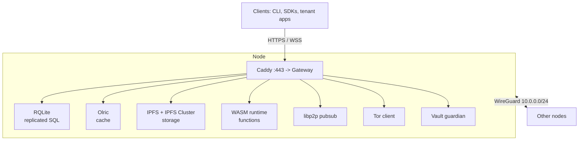

# Architecture overview

This page is the map. Orama is a **modular gateway and edge proxy**: clients reach an HTTPS gateway, and the gateway orchestrates a set of backend services that run on the same nodes, joined by an encrypted WireGuard mesh. The same software runs on every node. Nodes differ only in configuration flags and in which tenants have been placed on them.

## The layers

| Component | What it is | Role |
|---|---|---|
| **Gateway** | Go HTTP/WebSocket server | Authentication, authorization, routing, rate limiting, handlers for every API |
| **Caddy** | Reverse proxy | Public TLS (certificates from the shared store), forwards to the gateway on loopback |
| **RQLite** | SQLite replicated with Raft | The registry (cluster-wide) and every namespace's database |
| **Olric** | Distributed in-memory cache | The cache API, per namespace |
| **IPFS + IPFS Cluster** | Content-addressed storage in a private swarm | File storage, deployment content, backups |
| **libp2p GossipSub** | Messaging | Pub/sub, one service per node bridged by the gateway |
| **wazero** | WebAssembly runtime (in the gateway process) | Serverless functions |
| **CoreDNS** | Authoritative DNS (nameserver nodes) | Answers from a table in the registry |
| **WireGuard** | Mesh VPN | All inter-node traffic |
| **Tor** | Client-only | The anonymity proxy and relay |
| **Vault guardian** | Zig service | Shamir-split secrets |
| **Pion** | WebRTC | SFU and TURN |

## Two planes

Each node runs two kinds of workload, and both are built from the same systemd unit templates.

| Plane | Where | What |
|---|---|---|
| **Index** | Every node | The network's own state: which nodes exist, the DNS zone, API keys and grants, sessions, the audit trail, deployment records. Runs the cluster-wide **registry** RQLite, IPFS, the vault guardian, the **index gateway** (the control API), Caddy, ntfy, the Tor client, pub/sub. Nameserver nodes also run CoreDNS |
| **Tenant** | The 3 nodes chosen per namespace | One set of processes per namespace: its own RQLite, Olric and gateway, plus an SFU and TURN if WebRTC is on |

Platform state and tenant data are kept apart. A tenant's own database holds none of the platform's identity tables; a single placement list decides which database each table belongs to, and a test fails if a new table is left unplaced. See [Namespaces](/docs/developer/namespaces).

## Binaries

| Binary | What |
|---|---|
| `orama` | The CLI |
| `orama-node` | The supervisor that runs on each node ([Node process model](/docs/architecture/node-process-model)) |
| `orama-privhelper` | The privileged helper: the only path from the `orama` user to root actions |
| `gateway` | The HTTP gateway (cgo, because tenant SQLite needs it) |
| `identity` | Identity tool |
| `sfu`, `turn` | WebRTC media server and TURN relay |
| `orama-sni-router` | The TLS server-name router for stealth TURN |
| `pubsub` | The pub/sub service |
| `oramad`, `orama-global` | The chain and its services (separate module, not in the node archive) |

## Ports

| Port | Use |
|---|---|
| 22/tcp | SSH (not on OramaOS) |
| 53/tcp+udp | DNS (nameserver nodes) |
| 80, 443/tcp | HTTP, HTTPS |
| 51820/udp | WireGuard |
| 10000-10099 | Tenant namespace services (5 ports per namespace per node) |
| 10100-10109 | Index internals: RQLite 10100/10101, Olric, gateway 10104, pubsub, ntfy 10109 |
| 10110 | IPFS Cluster's Kubo proxy (loopback) |
| 10114 | IPFS Cluster swarm (WireGuard address) |
| 9050 | Tor SOCKS (loopback) |
| 3478, 5349, 49152-65535 | TURN, when WebRTC is on |
| 31000-31021 | The chain and global services ([Running a chain node](/docs/blockchain/running)) |

Only the first few are public; everything from 10000 up listens on the overlay or loopback.

## Where each request goes

1. DNS (CoreDNS on a nameserver node) resolves your name to some node, round-robin.
2. Caddy on that node terminates TLS and proxies to the index gateway on loopback.
3. The index gateway authenticates the request and, for a namespace host (`ns-<name>.<base>`), forwards it over the mesh to one of that namespace's three gateways, carrying the verified identity in headers protected by a MAC.
4. The namespace gateway authorizes it against the grant on every request and calls its own RQLite, Olric, IPFS or the WASM runtime.

The details are in [Request lifecycle](/docs/architecture/request-lifecycle).

## Scaling and availability

- **Horizontal.** More nodes means more namespaces (20 per node by port allocation) and more capacity. A namespace is always 3 nodes; a bigger cluster does not make namespaces bigger.
- **Availability.** Losing any single node loses no data and no availability: RQLite is a 3-voter Raft group, Olric and IPFS Cluster replicate, DNS has multiple nameservers, and each deployment runs on a home node and a replica. A namespace with one node (evaluation) has none of this.
- **Caching.** Grants and nonces are read at RQLite `weak` level (from the leader) so a first sign-in on a node that has not applied the log is not refused; per-request key lookups are cached.
- **Honest limit.** The design allows 20 namespaces per node and grows by adding nodes, but it has been exercised only at the scale of a few nodes and a few tenants.

## Related

- [Node process model](/docs/architecture/node-process-model)
- [Request lifecycle](/docs/architecture/request-lifecycle)
- [Security model](/docs/architecture/security-model)
- [WireGuard](/docs/operator/wireguard), [DNS](/docs/operator/nameserver), [TLS](/docs/operator/tls-certificates)
