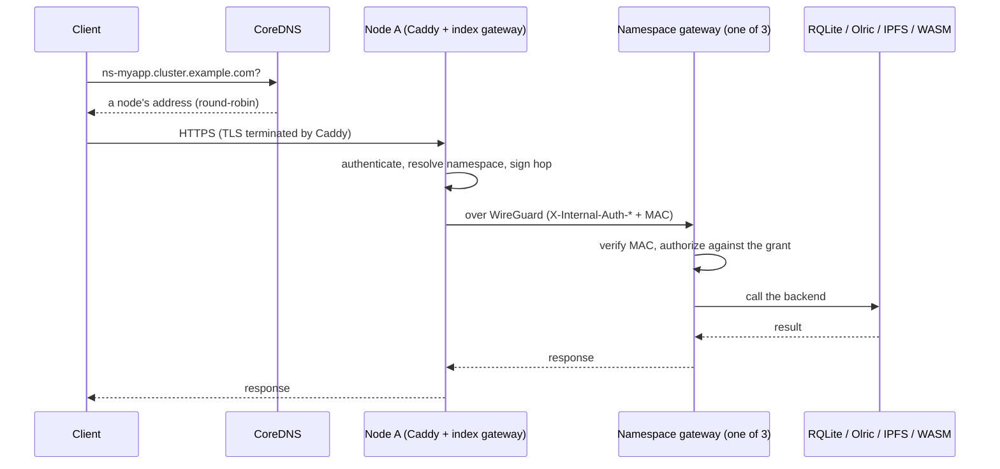

# Request lifecycle

What happens between your HTTPS request and the answer, and why each step is where it is.

## An HTTP request



1. **DNS.** The name resolves through your cluster's own nameservers, round-robin, so any node may receive the request.
2. **Caddy** terminates TLS with the cluster's shared wildcard certificate and reverse-proxies every path to the index gateway on loopback. Because of this, the source IP of every public request is `127.0.0.1`; nothing in the gateway may trust a source IP as an identity.
3. **The index gateway** runs the middleware chain below. For a namespace host it validates the credential against the registry and forwards the request to one of that namespace's gateways: this node's member when there is one, else the member the credential hashes to, then the others. A member whose circuit breaker is open is skipped, and one that refuses the connection is passed over for the next while none of the body has been read; a member that was reached and failed is not retried elsewhere.
4. **The namespace gateway** verifies the hop's MAC and checks the credential's grant for this domain, action and resource, then calls its own backend.

There is one circuit breaker per namespace gateway, so one tenant's failing gateway never refuses another tenant's requests on the same node. A breaker opens after 5 consecutive failures of the gateway itself (a refused or timed-out connection, or a 502, 503 or 504 it answered; never a 4xx or a function's own response), admits one probe every 30 seconds and closes on the first success. Open breakers are logged, and `orama monitor` reports them.

## The middleware stack

Outermost first. Rate limiting runs before authentication so the auth path itself is capped.

1. **Internal-auth gate.** Drops every `X-Internal-Auth-*` header that did not arrive with a valid MAC.
2. **Route policy.** Resolves what the matched route requires and puts it on the request. Every gate reads the policy the route declared, never the request path. A route with no declared policy cannot be registered.
3. **Logger.**
4. **Security headers.** Every `/v1/*` response carries `Cache-Control: no-store` unless the handler set its own.
5. **Rate limiting**, per client, before auth. The client is the peer address; `X-Forwarded-For` is honoured only when the peer is the local reverse proxy, and only its last entry. Traffic from another node over the overlay is exempt, but loopback *with* a forwarding header is not (every public request arrives from `127.0.0.1`). Buckets are keyed by the client's network: an IPv4 address, or an IPv6 /64.
6. **CORS.**
7. **Domain routing.** Maps a host to a deployment, a namespace, or the gateway itself.
8. **Authentication.** JWT or API key.
9. **Authorization.** Namespace access control.
10. **Scope gate.** Tightens an already-authorized request.
11. **Namespace rate limiting.**
12. **Handler.** Errors are returned as HTTP status.

Credential endpoints (challenge, verify, api-key, token, refresh) have their own bucket (30 a minute per address, burst 10) against a general 10,000, and `/v1/auth/challenge` is also limited per wallet.

## Why the hop carries a MAC

The index gateway validates a request and forwards the result to a namespace gateway in headers: the namespace it resolved, the JWT subject, custom claims, `exp`, `iat`, `jti`, the bound device and session (`did`, `sid`), and the grants of the key it looked up. The namespace gateway believes them without re-checking, so the question "should I believe these headers" is answered by an `X-Internal-Auth-MAC` header: HMAC-SHA256 over the method, path, every asserted field and a timestamp, keyed by `HKDF(cluster secret, "internal-auth-hop")`. The first middleware deletes any such header without a valid MAC. Caddy strips them on the way up too (`header_up -X-Internal-Auth-*`), so two independent places must fail before a forged header is believed. The MAC is consumed at the hop it authenticates and never forwarded. The window is ±60 s. It comes in versions (the original, V2 adding the token times and id, V3 adding device and session) so a rolling upgrade keeps working. A request is judged by the newest MAC it carries, alone.

## WebSocket flow (pub/sub)

```text
client connects -> upgrade -> authenticate -> subscribe to the node's pubsub service (unix socket)
   -> libp2p GossipSub <-> subscribers on this node and other nodes -> client receives messages
```

A message reaches a subscriber by exactly one path: the node's pub/sub service (`orama-namespace-pubsub@index`). A publish through the gateway fires serverless pub/sub triggers and is published to that service, which delivers it once to every subscriber on the publishing node and to those on other nodes. `POST /v1/pubsub/publish` answers `200` only once the service accepted the message, so one client's sequential publishes arrive in order; delivery to subscribers is asynchronous after that, and publishes from different clients have no relative order. The answer is 503 when the service does not take it, or 504 if it did not answer within 10 seconds.

The services of different nodes form one GossipSub mesh only because the cluster gateway connects them: every 15 seconds it asks its service for its address, registers it in the registry table `_pubsub_mesh_peers`, and has the service connect to every service seen in the last two minutes. The service's libp2p host is gated: it dials and accepts only `/ip4/<overlay ip>/tcp/<port>` addresses and only peers it was told about, GossipSub peer exchange is off, and there is no libp2p pre-shared key.

A subscriber socket lives as long as its reader: the gateway pings every 30 seconds and reads with a 75-second deadline that any frame refreshes. Presence and the subscription are always cleaned up.

## Serverless invocation

```text
Deploy:  upload WASM -> store in IPFS -> save metadata (RQLite) -> compile module
Invoke:  request -> load metadata -> get WASM from IPFS -> execute in sandbox -> return -> log
```

A namespace's functions are deployed to, stored in and run by that namespace's own gateway, against the namespace's own RQLite. A gateway's invoker runs only its own namespace's functions, whichever path asks (HTTP or WebSocket invoke, a cron or pub/sub trigger, the JWT claims provider, a nested `function_invoke`). Every other-namespace serverless request that reaches the cluster gateway is proxied to the namespace's gateway: to the namespace the request names (`/v1/invoke/<namespace>/…` or `?namespace=`), else to the credential's. The cluster gateway gives no function a database. See [Functions](/docs/developer/functions).

## Where state lives

| State | Where |
|---|---|
| Who someone is, grants, keys, sessions, revocations, the audit trail, signing keys | The cluster **registry** (index RQLite) |
| Your application data | Your **namespace's** RQLite |
| Cache | Your namespace's Olric |
| Files | The private IPFS swarm, pinned by IPFS Cluster |
| Deployments, domains | The registry (cluster state), served by the index gateway even when addressed to `ns-<name>` |

This separation matters: a namespace admin can export and replace their own database whole without touching keys or members.
