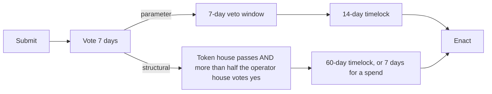

# Governance: the two houses

`x/houses` is Orama's governance module. It is implemented and wired, and it is **gated closed at genesis**: nothing can pass until the conditions below are met. It is not the Cosmos `x/gov` module, and stock modules still use an authority address that nobody can sign for. What the houses can change is the list under "What a passed proposal can do".

## Two houses

**The token house** votes with stake. A validator's delegators vote through it by default, and a direct vote moves that stake out of the validator's bucket. Inherited votes are capped at 3% of bonded stake per validator. Quorum is 40% of bonded stake and a proposal passes with more than 50% yes of participating weight. A tie never passes.

**The operator house** votes with identities, one vote each. An identity is an operator that has:

- at least 90 proven service days (see [Nodes](/docs/blockchain/nodes))
- a locked house bond of 1,000 ORAMA
- a known /16 network and a declared ASN

At most 3 identities per /16 and 5 per ASN are eligible; earlier bond locks win ties. A bond cannot be unlocked while a vote is open. Voting twice differently burns the bond and the equivocator's vote never counts.

## Proposals

A proposal carries exactly one of these.

| Tier | Type | Meaning |
|---|---|---|
| Parameter | `ParameterChange` | Token quorum, pass threshold, voting period, house bond, per-/16 and per-ASN eligibility caps, all inside bounds |
| Structural | `SoftwareUpgrade` | Name and height of a coordinated upgrade |
| Structural | `EmissionSplitChange` | Move the 60/25/10/5 split by at most 10 points each |
| Structural | `DevelopmentSpend` | Mint up to the epoch's development ceiling to a recipient |
| Structural | `PowerBoundsChange` | Activate the useful-work multiplier and set its maximum |
| Structural | `RelayReporterChange` | Add or remove relay reporters |
| Structural | `AllowListChange` | Code-upload hashes and the adapter allow-list for contracts |

There is no proposal deposit. A limit of 64 active proposals and the tier gates are what restrain spam.

## When each tier opens

- **Parameter tier:** bonded stake is at least 271,000 ORAMA or lambda has reached 1, and the eligible operator house has at least 21 members.
- **Structural tier and development spends:** lambda has reached 1, the operator house has at least 21 members, and those members span at least 7 distinct /16 networks and 5 ASNs.

## How a proposal moves

- Voting lasts 7 days. There is no expedited path.
- A parameter proposal needs the token house to pass it. A veto window follows, in which 30% of the eligible operator house voting NO vetoes it. Then a 14-day timelock.
- A structural proposal needs the token house to pass it and more than half of the eligible operator house to vote yes. Then a 60-day timelock for upgrades and the other structural actions, or 7 days for a development spend.
- If the module refuses an enactment, the proposal is marked `FAILED` and is not retried. Advance failures retry up to 5 times.

Bounds on what a parameter proposal can set: quorum 0.334 to 0.667, pass threshold 0.5 to 0.667, voting period 1 to 28 days, house bond 1 to 1,000,000 ORAMA, eligibility caps 1 to 21. Minimum house size (21 to 101), veto window, timelocks and the exit stake are genesis-only.

## What a passed proposal can do

| Proposal | What actually consumes it |
|---|---|
| Emission split | `x/emission` reads it at the next epoch close |
| Relay reporters | Applied through `x/relay`'s update message |
| Code-upload hashes | Consulted by `x/wasmpolicy` before the upload sunset height |
| Software upgrade | Scheduled in `x/upgrade` |
| Development spend | Minted and credited to the recipient's earnings |
| Power bounds (multiplier) | **Recorded only**. Nothing reads it yet |
| Adapter allow-list | **Recorded only**. Nothing reads it yet |

## What no proposal can touch

The emission schedule and tail, the burn rule, privacy by default, and the absence of freeze, blacklist, halt, pause, circuit-breaker or multisig powers. A test (`TestNoMessageReachesAnOssifiedField`) fails if any message can reach one of them.

## Messages and queries

Messages: `SubmitProposal`, `VoteToken`, `VoteOperator`, `LockHouseBond`, `UnlockHouseBond`, `ExecuteProposal`. Queries: `params`, `proposal`, `tiers`, `invariants`, `vote`, `house-bond`, `enacted`. The gateway's chain proxy withholds `tiers` and every `invariants` query.
