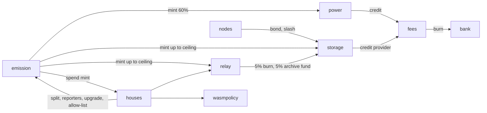

# The modules

Every module in `chain/x/`, what it does and whether it is live. "Live" means wired into `oramad` and exercised by tests on a test network. It does not mean the chain is public.

| Module | What it does | State |
|---|---|---|
| `emission` | Mints new ORAMA once per epoch on a fixed halving schedule. The only module that can mint `norama`. | Live. See [Supply](/docs/blockchain/supply) |
| `power` | Decides the voting power CometBFT uses, runs the bootstrap committee and the hand-over, pays validator rewards. | Live. See [Validators](/docs/blockchain/validators) |
| `fees` | EIP-1559-style base fee that is burned, tips to the proposer, earnings accounts, state deposits. | Live. See [Fees](/docs/blockchain/fees) |
| `nodes` | Registry of operators, nodes, roles, bonds and optional public cluster rows. | Live. See [Nodes](/docs/blockchain/nodes) |
| `storage` | Storage deals, provider slots, challenges, proofs, settlement, subsidy. | Live. See [Storage deals](/docs/blockchain/storage-deals) |
| `archive` | Registry of archived block ranges so validators can prune history. | Live. See [History archive](/docs/blockchain/archive) |
| `relay` | Registry of Tor relays and exits and the per-epoch report that decides rewards. | Registration, reports and settlement live: the end block pays each operator's epoch total through the 90/5/5 service split. No relay is running yet. See [Relay rewards](/docs/blockchain/relay-rewards) |
| `houses` | Two-house governance. | Live, gated closed at genesis. See [Governance](/docs/blockchain/governance) |
| `token` | Token factory: `factory/<creator>/<subdenom>` denoms with optional mint, freeze, pause, transfer-fee and transfer-hook (a contract) capabilities. | Live. See [Token factory](/docs/blockchain/token-factory) |
| `cnft` | Compressed NFTs in concurrent Merkle trees. | Live. See [NFTs and market](/docs/blockchain/nfts-and-market) |
| `market` | Fixed-price listings and bids for cNFTs with creator royalties. | Live. Same page |
| `shielded` | The Ironwood shielded pool. | Implemented. Accepts bundles only on nodes with both verifiers. See [Shielded](/docs/blockchain/shielded) |
| `wasm` | CosmWasm contracts. | Live in cgo builds only. See [Contracts](/docs/blockchain/contracts) |
| `wasmpolicy` | Rules around contracts: upload closed until a sunset height, state deposits. | Always wired |
| `wasmbindings` | The Orama calls a contract may make (tokens, NFTs, market, storage deals, earnings). | Linked in cgo builds |
| `inclusion` | Inclusion lists through vote extensions so a proposer cannot censor a transaction. | Wired, off until genesis sets a start height |
| `confidential` | Attestation boundary for confidential compute. | Fails closed on every input. Not wired |
| `vpnlaunch` | A predicate that says when a public VPN beta could open. | No chain state, not linked into `oramad`. Its launch switch is off in every build |

## How the modules connect

- `emission` is the only way new `norama` enters existence. Every other module asks it.
- Earnings accounts live in `fees`. Every payout from another module lands there.
- `nodes` holds the bonds that `storage` slashes.
- `houses` can reach only the things its enactment table lists. It cannot touch the halving schedule, the burn rule, or anything that would freeze or blacklist an account.

## Standard Cosmos modules and what changed

- `staking` still owns bonds, delegations, unbonding and jailing. Its own validator-set updates are discarded; `power` is the only module that tells CometBFT who validates.
- `slashing` applies to every CometBFT validator including the bootstrap committee.
- `distribution` is wired for plumbing only. The community tax is zero and Orama pays rewards through `power`.
- `upgrade`, `consensus`, `bank` and `staking` parameter messages use the unreachable authority described in [What the chain is](/docs/blockchain/what-it-is).
- `feegrant` is honoured by the fee decorator: a granter can pay a base fee from its bank balance (never from earnings).
