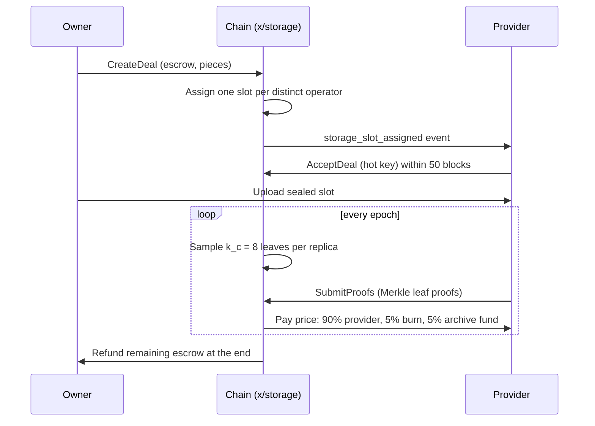

# Storage deals

A storage deal is an on-chain agreement: you escrow ORAMA, a set of providers each hold one encrypted piece of your file, and every epoch each provider has to prove it still has the data. Providers who prove get paid. Providers who miss are penalised and eventually evicted, and a repair delegate rebuilds the lost piece.

This is separate from the IPFS storage in the gateway ([Storage](/docs/developer/storage)). Gateway storage is metered by nothing and lives inside a namespace. A storage deal lives on the chain and is held by independent providers.

## Deal classes

| Class | What it stores |
|---|---|
| `PRIVATE` | One commitment per replica. Each provider gets a different ciphertext |
| `PUBLIC_PIN` | One commitment copied onto every slot. This is retrievability, not unique storage |
| `ARCHIVE` | Protocol-only (used by the history archive). A user cannot create one |

A deal has 3 to 32 replicas and runs for 1 to 1,000,000 epochs. Escrow is `price per epoch x replicas x duration`, plus a burned fee of 1,000 norama.

## Lifecycle



1. **Create.** The deal opens and is queued. Slots go to nodes with an active STORAGE role, one slot per distinct operator. Protocol deals also need a known /16 and a declared ASN.
2. **Accept or decline.** The assigned node's *hot key* accepts or declines inside the accept window (50 blocks). Declining has no penalty. A timeout reassigns the slot to another operator.
3. **Upload.** The owner uploads each sealed slot to its provider (`POST /pieces/<root>` on the provider service).
4. **Challenge and prove.** Every epoch the chain samples 8 leaves per replica. The provider answers with a Merkle leaf-inclusion proof.
5. **Settle.** At epoch close each challenge is scored into a settlement row, up to 100 per block. A proved slot is paid out of escrow.
6. **Miss.** A missed challenge raises a consecutive-miss count. From the second consecutive miss the node is penalised 10% of one epoch's price. At 4 misses the slot is evicted and repaired. A bonded node is slashed through `x/nodes`; a probation node's record deposit is burned instead.

Each failing item is isolated: the block continues and a `storage_item_failed` event is emitted.

## Who gets paid and how much

A proved slot pays `price per epoch` out of escrow, split:

- 90% to the provider's earnings
- 5% burned
- 5% to the archive fund

For `PRIVATE` deals there is also a subsidy, minted from the storage ceiling: `s x price`, where `s` is 0 while fewer than 8 operators are active and rises linearly to 1.0 at 32. It is capped per operator at ceiling divided by 8. Protocol `PUBLIC_PIN` and `ARCHIVE` deals are paid from the storage ceiling, and `ARCHIVE` is topped up from the archive fund.

## Probation

A node with the STORAGE role and no bond can take protocol-deal slots only. It is jailed after 4 epochs with no proof and graduates once it has proven storage or bonded. Per operator, /16 and ASN at most 2 probation slots are allowed.

## Parameters (production genesis values)

| Parameter | Value |
|---|---|
| `min_deal_bytes` | 1024 |
| `deal_fee` | 1,000 norama (burned) |
| `max_deals_per_block` | 100 |
| `k_c` (leaves sampled per provider per epoch) | 8 |
| `miss_threshold` | 4 |
| `s_min_providers` / `s_full_providers` | 8 / 32 |
| `accept_window_blocks` | 50 |
| `slash_fraction` | 0.1 |
| `max_releases_per_epoch` | 2 |
| `max_settlements_per_block` | 100 |
| Settlement attempts | 5 |

Many of these are marked "launch default": they are the plan's starting values and have not been tuned on a public network.

## Authorizing a cluster to spend for you

`orama storage grant` gives a cluster a capped allowance (not SDK authz): a spend limit, a period, a maximum piece size, a maximum duration, a replica count and an expiry. `orama storage revoke` removes it. This is how a cluster can open deals on a user's behalf without holding their key.

## Privacy of the data

Files are sealed on your machine before anything is uploaded.

- `orama storage seal` wraps a random file key under your `orama-storage-v1` key from RootWallet (an XChaCha20-Poly1305 wrap) and writes one ciphertext per slot, each with a different keystream derived from a repair seed.
- Providers never see plaintext. A *repair delegate* holding the repair seed can rebuild a lost slot by re-wrapping a surviving replica (`orama storage rewrap`) without ever seeing the file.
- `orama storage open` decrypts one slot. `orama storage get` fetches and opens a private file from its providers.

The key file for `--storage-key-file` is the dedicated `orama-storage-v1` key (32 bytes, hex, mode 0600), never the wallet seed.

## The commands

```
orama storage seal    --in file --out-dir slots/ --nonce <hex> --replicas 3 --storage-key-file k --repair-seed-file s
orama storage create  ...   open a PRIVATE or PUBLIC_PIN deal from piece roots you already have
orama storage put     ...   upload sealed slots to the providers a deal assigned
orama storage extend  ...   add epochs
orama storage prove   ...   submit proofs from a JSON file (provider side)
orama storage accept / decline   answer an assigned slot (signed by the node's hot key)
orama storage get / open / rewrap
```

`create`, `extend`, `accept`, `decline`, `prove`, `grant` and `revoke` build a transaction. With `--node` they sign through the RootWallet agent and broadcast; without it they print the sign document and submit nothing. `create` does not encrypt or upload the bytes, and `prove` does not choose the challenged leaf. See the [full flags](/docs/developer/cli/storage).

## The provider service

Providers run `orama-global provider` (port 31013). It proves unproved challenges first, then reads `storage_slot_assigned` events and accepts or declines. It can pin `PUBLIC_PIN` and `ARCHIVE` pieces in a public Kubo node. Private ciphertext never reaches the public Kubo. See [Global nodes](/docs/operator/global-nodes).

## Queries

`Params`, `Deal`, `Slot`, `Authorization`, `Challenges` (needs `node_id`), `EpochMint`, `Queue` and `NodeFailures` are public through the gateway. The `Invariants` query is withheld.
