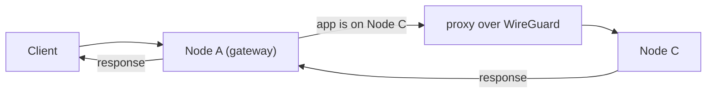

# Deployments

Deploy applications to the Orama decentralized network. The CLI supports four deployment types: static sites, Next.js SSR, Go backends, and Node.js backends. Each deployment is distributed across nodes, served via Caddy, and assigned a domain automatically.

## Deployment Types

| Type | Command | Use Case |
|------|---------|----------|
| **Static** | `orama deploy static` | React, Vue, Svelte, any pre-built SPA or static site |
| **Next.js** | `orama deploy nextjs` | Server-rendered Next.js with `output: 'standalone'` |
| **Go** | `orama deploy go` | Go binaries with HTTP server |
| **Node.js** | `orama deploy nodejs` | Express, Fastify, any Node.js HTTP server |

Static sites are uploaded to IPFS and served via Caddy. Server-side deployments (Next.js, Go, Node.js) run as managed processes on the node.

### Deploy Flags

All deploy commands share these flags:

| Flag | Required | Description |
|------|----------|-------------|
| `--name` | Yes | Deployment name. Used in the domain: `<name>-<random>.<base-domain>` |
| `--subdomain` | No | Custom subdomain override (default: uses `--name`) |
| `--update` | No | Update an existing deployment instead of creating a new one |

Next.js has one additional flag:

| Flag | Required | Description |
|------|----------|-------------|
| `--ssr` | No | Deploy with server-side rendering (standalone mode) |

---

## Static Sites

For React, Vue, Svelte, or any framework that compiles to static HTML/JS/CSS. Build your project first, then deploy the output directory.

**React (Vite)**

```bash
npm run build
orama deploy static ./dist --name my-app
```

**Vue**

```bash
npm run build
orama deploy static ./dist --name my-vue-app
```

**Plain HTML**

```bash
orama deploy static ./public --name my-site
```

The CLI tarballs the directory, uploads it to IPFS, and configures Caddy to serve it. SPA routing (history mode) is handled automatically — all paths resolve to `index.html`.

### Example: React + Vite

```bash
npx create-vite my-app --template react-ts
cd my-app
npm install
npm run build
orama deploy static ./dist --name my-app
```

Your app is live at a URL like `my-app-f3o4if.orama-devnet.network`.

To update an existing deployment:

```bash
npm run build
orama deploy static ./dist --name my-app --update
```

---

## Next.js SSR

Next.js deployments require standalone output mode. The CLI uploads the `.next/standalone` directory and runs the Next.js server process on the node.

### Configuration

Set `output: 'standalone'` in `next.config.js`:

```javascript
/** @type {import('next').NextConfig} */
const nextConfig = {
  output: 'standalone',
};

module.exports = nextConfig;
```

This tells Next.js to bundle everything into a self-contained directory that can run without `node_modules`.

### Deploy

```bash
npm run build
orama deploy nextjs . --name my-nextjs --ssr
```

The `--ssr` flag tells the CLI to look for the standalone output in `.next/standalone` and deploy it as a server process. The process runs on the node and Caddy reverse-proxies requests to it.

Update an existing Next.js deployment:

```bash
npm run build
orama deploy nextjs . --name my-nextjs --ssr --update
```

### Requirements

- `output: 'standalone'` in `next.config.js` (mandatory)
- The `--ssr` flag on the deploy command
- A `/health` endpoint or Next.js API route that returns 200

---

## Go Backends

Deploy compiled Go binaries. The binary must implement an HTTP server that listens on the port specified by the `PORT` environment variable and exposes a `/health` endpoint.

### Requirements

- Binary must listen on `PORT` env var (the node assigns the port)
- Must implement `GET /health` returning HTTP 200
- Name the binary `app` for auto-detection, or specify the path explicitly

### Example

```go
package main

import (
	"fmt"
	"log"
	"net/http"
	"os"
)

func main() {
	port := os.Getenv("PORT")
	if port == "" {
		port = "8080"
	}

	http.HandleFunc("/health", func(w http.ResponseWriter, r *http.Request) {
		w.WriteHeader(http.StatusOK)
		fmt.Fprint(w, "ok")
	})

	http.HandleFunc("/", func(w http.ResponseWriter, r *http.Request) {
		fmt.Fprint(w, "Hello from Orama Network")
	})

	log.Printf("listening on :%s", port)
	log.Fatal(http.ListenAndServe(":"+port, nil))
}
```

Build and deploy:

```bash
GOOS=linux GOARCH=amd64 go build -o app .
orama deploy go ./app --name my-api
```

Cross-compile for Linux/amd64 — Orama nodes run Linux.

---

## Node.js Backends

Deploy Node.js applications. The project must have a `start` script in `package.json` and a `/health` endpoint.

### Requirements

- `package.json` with a `start` script
- Must listen on `PORT` env var
- Must implement `GET /health` returning HTTP 200

### Example

```json
{
  "name": "my-api",
  "scripts": {
    "start": "node server.js"
  },
  "dependencies": {
    "express": "^4.18.0"
  }
}
```

```javascript
const express = require("express");
const app = express();
const port = process.env.PORT || 3000;

app.get("/health", (req, res) => res.send("ok"));

app.get("/api/items", (req, res) => {
  res.json([{ id: 1, name: "Item 1" }]);
});

app.listen(port, () => {
  console.log(`listening on :${port}`);
});
```

Deploy:

```bash
orama deploy nodejs . --name my-api
```

The CLI uploads the project directory and runs `npm start` on the node.

---

## Domains and Routing

Every deployment is assigned a domain automatically:

```
<name>-<random>.<base-domain>
```

For example, deploying `my-app` on devnet:

```
my-app-f3o4if.orama-devnet.network
```

The random suffix ensures uniqueness. You can also specify a custom subdomain with `--subdomain`.

### Cross-Node Routing

The Orama gateway runs on every node. When a request arrives at a node that doesn't host the target app, the gateway proxies the request to the correct node transparently. From the client's perspective, any node can serve any app.



This means DNS can round-robin across all nodes. The gateway mesh handles routing internally over the WireGuard overlay network.

---

## Deployment Lifecycle

### List Deployments

```bash
orama app list
```

### Get Deployment Details

```bash
orama app get my-app
```

Returns status, version, assigned node, domain, and resource usage.

### Logs

```bash
# Tail logs in real-time
orama app logs my-app --follow

# View recent logs
orama app logs my-app
```

### Rollback

Every deploy creates a new version. Rollback to any previous version:

```bash
# Rollback to version 1
orama app rollback my-app --version 1
```

The previous version's artifacts are retained on IPFS (static) or in the deployment store (server-side), so rollbacks are near-instant.

### Delete

```bash
orama app delete my-app
```

Removes the deployment, frees the domain, and cleans up resources on the node.

---

## Environment Variables

Server-side deployments (Next.js, Go, Node.js) receive the following environment variable automatically:

| Variable | Description |
|----------|-------------|
| `PORT` | Port the app must listen on. Assigned by the node. |

`NODE_ENV=production` is set while dependencies are installed at deploy time (`npm install`), but it is not injected into the running app's environment -- set it yourself if your app relies on it at runtime.

---

## SQLite Databases

Orama provides per-namespace SQLite databases. Use them alongside your deployments for persistent storage.

```bash
# Create a database
orama db create my-database

# Run queries
orama db query my-database "CREATE TABLE items (id INTEGER PRIMARY KEY, name TEXT)"
orama db query my-database "INSERT INTO items (name) VALUES ('Widget')"
orama db query my-database "SELECT * FROM items"

# Backup
orama db backup my-database
```

See [Databases](/docs/developer/databases) for full documentation.

---

## Full-Stack Example: React + Go + SQLite

A complete example: React frontend, Go API, and a SQLite database.

### 1. Create the Database

```bash
orama db create todo-db
orama db query todo-db "CREATE TABLE todos (id INTEGER PRIMARY KEY AUTOINCREMENT, title TEXT NOT NULL, done BOOLEAN DEFAULT 0)"
```

### 2. Deploy the Go API

```go
package main

import (
	"encoding/json"
	"fmt"
	"log"
	"net/http"
	"os"
)

type Todo struct {
	ID    int    `json:"id"`
	Title string `json:"title"`
	Done  bool   `json:"done"`
}

func main() {
	port := os.Getenv("PORT")
	if port == "" {
		port = "8080"
	}

	http.HandleFunc("/health", func(w http.ResponseWriter, r *http.Request) {
		w.WriteHeader(http.StatusOK)
	})

	http.HandleFunc("/api/todos", func(w http.ResponseWriter, r *http.Request) {
		w.Header().Set("Content-Type", "application/json")
		todos := []Todo{
			{ID: 1, Title: "Deploy to Orama", Done: true},
		}
		json.NewEncoder(w).Encode(todos)
	})

	log.Printf("listening on :%s", port)
	log.Fatal(http.ListenAndServe(":"+port, nil))
}
```

```bash
GOOS=linux GOARCH=amd64 go build -o app .
orama deploy go ./app --name todo-api
```

### 3. Deploy the React Frontend

Configure the API URL to point at your Go deployment:

```typescript
const API_URL = "https://todo-api-k8x2mq.orama-devnet.network"; // URL from orama app get

async function fetchTodos() {
  const res = await fetch(`${API_URL}/api/todos`);
  return res.json();
}
```

```bash
npm run build
orama deploy static ./dist --name todo-app
```

### 4. Verify

```bash
orama app list
orama app get todo-api
orama app get todo-app
orama app logs todo-api --follow
```

Your full-stack app is live. Check the URLs with `orama app get todo-api` and `orama app get todo-app`.

---

## Programmatic Deployments

For CI/CD pipelines, use the CLI directly. Deployments are managed via the REST API:

```bash
# In CI/CD, set credentials via environment variable
export ORAMA_TOKEN=your-api-key

# Deploy
orama deploy static ./dist --name my-app --update
```

The gateway exposes deployment REST endpoints at `/v1/deployments/{type}/upload` and `/v1/deployments/{type}/update` that accept multipart file uploads with authentication.
