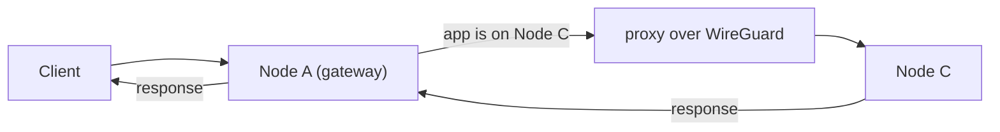

# Deployments

Deploy applications to the Orama decentralized network. The CLI supports four deployment types: static sites, Next.js SSR, Go backends, and Node.js backends. Each deployment is distributed across nodes, served via Caddy, and assigned a domain automatically.

## Deployment Types

| Type | Command | Use Case |
|------|---------|----------|
| **Static** | `orama deploy static` | React, Vue, Svelte, any pre-built SPA or static site |
| **Next.js** | `orama deploy nextjs` | Server-rendered Next.js with `output: 'standalone'` |
| **Go** | `orama deploy go` | Go binaries with HTTP server |
| **Node.js** | `orama deploy nodejs` | Express, Fastify, any Node.js HTTP server |

Static sites are uploaded to IPFS and served via Caddy. Server-side deployments (Next.js, Go, Node.js) run as managed processes on the node.

### Deploy Flags

All deploy commands share these flags:

| Flag | Required | Description |
|------|----------|-------------|
| `--name` | Yes | Deployment name. Used in the domain: `<name>-<random>.<base-domain>` |
| `--subdomain` | No | Custom subdomain override (default: uses `--name`) |
| `--update` | No | Update an existing deployment instead of creating a new one |
| `--env KEY=VALUE` | No | Environment variable (repeatable). First deploy only; not on `--update` |
| `--env-file <file>` | No | Read variables from a `.env` file. First deploy only |
| `--health-check <path>` | No | Path the platform polls to decide the app is up (default `/health`). Not on static sites |

### Names and limits

A deployment name is 1 to 56 characters of letters, digits, `-` and `_`, starting with a letter or digit. Anything else is refused with `400` before the upload is stored: the name becomes part of the app's subdomain (one DNS label) and of the systemd unit that runs it (`orama-deploy-<runtime>@<namespace>-<name>`).

A new deployment is refused with `409` when one with the same name already exists in the namespace (deploy again with `--update`), or when its `<namespace>-<name>` is already another deployment's unit instance (namespace `a` with name `b-c` and namespace `a-b` with name `c` would share one unit, directory and environment file; choose a different name). The node enforces this by creating the deployment's directory, which only one request can do.

Next.js has one additional flag:

| Flag | Required | Description |
|------|----------|-------------|
| `--ssr` | No | Deploy with server-side rendering (standalone mode) |

---

## Static Sites

For React, Vue, Svelte, or any framework that compiles to static HTML/JS/CSS. Build your project first, then deploy the output directory.

**React (Vite)**

```bash
npm run build
orama deploy static ./dist --name my-app
```

**Vue**

```bash
npm run build
orama deploy static ./dist --name my-vue-app
```

**Plain HTML**

```bash
orama deploy static ./public --name my-site
```

The CLI tarballs the directory, uploads it to IPFS, and configures Caddy to serve it. SPA routing (history mode) is handled automatically — all paths resolve to `index.html`.

### Example: React + Vite

```bash
npx create-vite my-app --template react-ts
cd my-app
npm install
npm run build
orama deploy static ./dist --name my-app
```

Your app is live at a URL like `my-app-f3o4if.cluster.example.com`.

To update an existing deployment:

```bash
npm run build
orama deploy static ./dist --name my-app --update
```

---

## Next.js SSR

Next.js deployments require standalone output mode. The CLI uploads the `.next/standalone` directory and runs the Next.js server process on the node.

### Configuration

Set `output: 'standalone'` in `next.config.js`:

```javascript
/** @type {import('next').NextConfig} */
const nextConfig = {
  output: 'standalone',
};

module.exports = nextConfig;
```

This tells Next.js to bundle everything into a self-contained directory that can run without `node_modules`.

### Deploy

```bash
npm run build
orama deploy nextjs . --name my-nextjs --ssr
```

The `--ssr` flag tells the CLI to look for the standalone output in `.next/standalone` and deploy it as a server process. The process runs on the node and Caddy reverse-proxies requests to it.

Update an existing Next.js deployment:

```bash
npm run build
orama deploy nextjs . --name my-nextjs --ssr --update
```

### Requirements

- `output: 'standalone'` in `next.config.js` (mandatory)
- The `--ssr` flag on the deploy command
- A `/health` endpoint or Next.js API route that returns 200

---

## Go Backends

Deploy compiled Go binaries. The binary must implement an HTTP server that listens on the port specified by the `PORT` environment variable and exposes a `/health` endpoint.

### Requirements

- Binary must listen on `PORT` env var (the node assigns the port)
- Must implement `GET /health` returning HTTP 200
- Name the binary `app` for auto-detection, or specify the path explicitly

### Example

```go
package main

import (
	"fmt"
	"log"
	"net/http"
	"os"
)

func main() {
	port := os.Getenv("PORT")
	if port == "" {
		port = "8080"
	}

	http.HandleFunc("/health", func(w http.ResponseWriter, r *http.Request) {
		w.WriteHeader(http.StatusOK)
		fmt.Fprint(w, "ok")
	})

	http.HandleFunc("/", func(w http.ResponseWriter, r *http.Request) {
		fmt.Fprint(w, "Hello from Orama Network")
	})

	log.Printf("listening on :%s", port)
	log.Fatal(http.ListenAndServe(":"+port, nil))
}
```

Build and deploy:

```bash
GOOS=linux GOARCH=amd64 go build -o app .
orama deploy go ./app --name my-api
```

Cross-compile for Linux/amd64 — Orama nodes run Linux.

---

## Node.js Backends

Deploy Node.js applications. The project must have a `start` script in `package.json` and a `/health` endpoint.

### Requirements

- `package.json` with a `start` script
- Must listen on `PORT` env var
- Must implement `GET /health` returning HTTP 200

### Example

```json
{
  "name": "my-api",
  "scripts": {
    "start": "node server.js"
  },
  "dependencies": {
    "express": "^4.18.0"
  }
}
```

```javascript
const express = require("express");
const app = express();
const port = process.env.PORT || 3000;

app.get("/health", (req, res) => res.send("ok"));

app.get("/api/items", (req, res) => {
  res.json([{ id: 1, name: "Item 1" }]);
});

app.listen(port, () => {
  console.log(`listening on :${port}`);
});
```

Deploy:

```bash
orama deploy nodejs . --name my-api
```

The CLI uploads the project directory and runs `npm start` on the node.

---

## Domains and Routing

Every deployment is assigned a domain automatically:

```
<name>-<random>.<base-domain>
```

For example, deploying `my-app` on devnet:

```
my-app-f3o4if.cluster.example.com
```

The random suffix ensures uniqueness across every namespace. You can also specify a custom subdomain with `--subdomain`. The bare `<name>.<base-domain>` is only the address of a deployment created before subdomains existed; a deployment that has a subdomain is not served at its bare name, and when two namespaces each still hold a subdomain-less deployment of the same name, the bare host answers `404` for both until one is deleted.

### Cross-Node Routing

The Orama gateway runs on every node. When a request arrives at a node that doesn't host the target app, the gateway proxies the request to the correct node transparently. From the client's perspective, any node can serve any app.


```mermaid
graph LR
    C["Client"] --> A["Node A (gateway)"]
    A -->|"app is on Node C"| P["proxy over WireGuard"]
    P --> N["Node C"]
    N -->|"response"| A
    A -->|"response"| C
```

This means DNS can round-robin across all nodes. The gateway mesh handles routing internally over the WireGuard overlay network.

---

## Deployment Lifecycle

### List Deployments

```bash
orama app list
```

### Get Deployment Details

```bash
orama app get my-app
```

Returns status, version, assigned node, domain, and resource usage.

### Logs

```bash
# Tail logs in real-time
orama app logs my-app --follow

# View recent logs
orama app logs my-app
```

### Rollback

Every deploy creates a new version. Rollback to any previous version:

```bash
# Rollback to version 1
orama app rollback my-app --version 1
```

The previous version's artifacts are retained on IPFS (static) or in the deployment store (server-side), so rollbacks are near-instant.

### Delete

```bash
orama app delete my-app
```

Removes the deployment, frees the domain, and cleans up resources on the node.

---

## Environment variables

Go, Node.js and Next.js SSR deployments run as a process that reads its configuration from environment variables. Set them at deploy time or change them afterwards without redeploying.

```bash
orama deploy go ./my-api --name my-api --env DATABASE_URL=postgres://... --env LOG_LEVEL=debug
orama deploy go ./my-api --name my-api --env-file .env.production
```

`--env` is repeatable and splits on the first `=` only, so a value may contain one. `--env-file` reads `KEY=VALUE` per line, skips `#` comments and blank lines, and removes one layer of surrounding quotes. It does **not** expand `$VAR`: the literal text in the file is sent. A `--env` on the command line overrides the same name from the file. They belong to a first deploy; with `--update` the CLI refuses them, because an update replaces the build and never reads variables.

### After deploying

```bash
orama app env list my-api
orama app env set my-api --env DATABASE_URL=postgres://...
orama app env set my-api --env-file .env.production
orama app env unset my-api OLD_FLAG DEBUG_MODE
```

Setting or removing a variable rewrites the app's environment file and restarts it. A static site has no process, so its variables are recorded and nothing restarts. The change reaches **every node that runs the app**, and the command succeeds only when all of them applied it; a node that could not be reached is named in the error (status 502), still runs the old environment, and running the same command again retries every replica (applying an environment is idempotent). During a rolling upgrade an environment change on an app with a not-yet-upgraded replica fails with 502 naming that node; run it again once that node is upgraded.

`list` shows names, never values, because environment variables are where secrets live.

### What the platform sets for you

These names cannot be overwritten or removed.

| Name | What it is |
|---|---|
| `PORT` | The port your app must listen on, over TCP. It is the only port your app may bind: any other port, or a UDP socket, fails with `EPERM`. Outbound connections are unaffected |
| `ENTRY_POINT` | What a Node.js deployment runs: `npm:start` runs `npm start`, anything else runs `node <that file>`, no value runs `node index.js` |
| `ORAMA_ENTRYPOINT` | The script the runtime starts, derived from `ENTRY_POINT` |
| `ORAMA_NAMESPACE` | The namespace this deployment belongs to |
| `ORAMA_GATEWAY_URL` | Your namespace's own gateway, `https://ns-<namespace>.<base-domain>` |
| `ORAMA_STATE_DIR` | A directory your app may write to that survives restarts |
| `ORAMA_CACHE_DIR` | A directory your app may write to that it must not rely on |
| `ORAMA_TOKEN_FILE` | The file holding your app's own short-lived token (below) |

`NODE_ENV=production` is set while dependencies are installed at deploy time but is not injected into the running app; set it yourself if your app relies on it.

### Your app's own credential

Your app is a principal of its own. At start it is handed a short-lived token in the file named by `$ORAMA_TOKEN_FILE` and renews it before it expires. It reaches **nothing** until you grant it something:

```bash
orama app grants set my-api runtime      # invoke, storage, push, webrtc, proxy, pubsub, cache
orama app grants list
```

```js
const token = await readFile(process.env.ORAMA_TOKEN_FILE, "utf8");
const res = await fetch(`${process.env.ORAMA_GATEWAY_URL}/v1/auth/renew`, {
  method: "POST", headers: { Authorization: `Bearer ${token}` },
});
const { access_token, expires_in } = await res.json();
```

`orama app grants set` names a deployment that exists in the namespace: a name a deployment cannot have (it contains `/` or `:`) is refused `400`, and a name nobody has deployed `404`, so deploy first and grant after. The grant decides what the app may do wherever its token is read, not only at renewal, so narrowing or revoking it applies to a token already minted. A token whose subject names one namespace and whose claim names another is refused wherever it is verified.

In the SDK use `createWorkloadClient()`. A deployment cannot be granted the control plane. See [Access control](/docs/developer/access-control#a-deployed-app-s-identity).

### Where your app may write

Your app's own directory is read-only: its files are its build output, and a process that can rewrite its own code cannot be rolled back to a known version. Write to `$ORAMA_STATE_DIR` (yours alone; survives restarts) or `$ORAMA_CACHE_DIR` (anything you can regenerate). Files there are private to the app (`UMask=0077`).

### How values are handled

Values are held encrypted in the cluster database (AES-256-GCM, key derived from the cluster secret) and sealed to the deployment's namespace and id, so a copy of the stored value in another deployment's row does not open. On a cluster upgraded from an earlier release the sealing starts when an operator runs `orama operator rotate-secrets`; a new cluster has it from its first row. On the node they are written to a file only the system can read, which systemd hands to your process; they are not written into the unit and are removed when the deployment stops. A value may contain any valid UTF-8 except NUL (a PEM key or a JSON blob goes in as it is), one value is at most 64 KiB, and the whole rendered environment at most 224 KiB (larger is refused `400`).

### What your app runs as

Each deployment runs as its own unprivileged user, allocated for it and reclaimed when it stops. No two deployments share an identity and none is root. It cannot reach the cluster's internal network, it has the memory, CPU and process limits recorded on the deployment, and of the platform's directory tree it sees only its own deployment directory, read-only. The unit is an instance of a template (`orama-deploy-node@`, `orama-deploy-npm@` or `orama-deploy-go@`) installed with the platform; the gateway writes only the environment file and starts the template.

### Health check

The platform polls `--health-check` (default `/health`) to decide the app has started.

### Why there is no `orama.yaml`

A project file for name, type, environment and health check is deliberately not built yet: it would need precedence rules against flags, a version field, validation, and an answer for what a checked-in file does with secrets. `--env-file` covers the part that hurt most.

---

## Replicas and updates

A dynamic deployment (Next.js SSR, Node.js, Go) runs on its **home node** and on a second node, its **replica**. After the home node pins the build it asks the replica to set up; the replica polls for the artifact (every 2 s, up to 60 s) rather than failing on the first miss. A setup that fails is recorded (`replica_setup_failed` in `GET /v1/deployments/events`) and the cluster leader's reconciliation, every 5 minutes, sets it up again.

An **update** (`--update`) and a **rollback** are applied on the home node, then on every active replica, and the command waits for each. It succeeds only when all replicas applied it; a replica that did not is reported with status 502, naming how many applied it and each node that did not (a `replica_update_failed` event is recorded). The home node already runs the new version and the failed nodes keep serving the old one. Running the same update or rollback again retries it. Each call carries the deployment's version, and a replica refuses a version older than the one it applied. Updates, rollbacks and environment changes of one deployment take turns on the home node; one that finds the lock held past 120 s is refused with 503 (run it again).

Changes are made on the home node only, so one that reaches another gateway is forwarded, and refused with 503 and `Retry-After` if the home node does not answer. **Delete** is not tied to the home node, so a deployment whose home node is gone for good can still be deleted.

Each node's health checker probes its local replicas' ports every 30 seconds. A `failed` replica returns to `active` only when the probe answers **and** its own unit reports active. The same checker reaps orphan runtime units (a unit whose deployment row is gone) every 2 minutes, conservatively: the unit must be unmatched on two consecutive sweeps, at least 10 minutes old, and at most 2 are stopped per sweep.

---

## SQLite Databases

Orama provides per-namespace SQLite databases. Use them alongside your deployments for persistent storage.

```bash
# Create a database
orama db create my-database

# Run queries
orama db query my-database "CREATE TABLE items (id INTEGER PRIMARY KEY, name TEXT)"
orama db query my-database "INSERT INTO items (name) VALUES ('Widget')"
orama db query my-database "SELECT * FROM items"

# Backup
orama db backup my-database
```

See [Databases](/docs/developer/databases) for full documentation.

---

## Full-Stack Example: React + Go + SQLite

A complete example: React frontend, Go API, and a SQLite database.

### 1. Create the Database

```bash
orama db create todo-db
orama db query todo-db "CREATE TABLE todos (id INTEGER PRIMARY KEY AUTOINCREMENT, title TEXT NOT NULL, done BOOLEAN DEFAULT 0)"
```

### 2. Deploy the Go API

```go
package main

import (
	"encoding/json"
	"fmt"
	"log"
	"net/http"
	"os"
)

type Todo struct {
	ID    int    `json:"id"`
	Title string `json:"title"`
	Done  bool   `json:"done"`
}

func main() {
	port := os.Getenv("PORT")
	if port == "" {
		port = "8080"
	}

	http.HandleFunc("/health", func(w http.ResponseWriter, r *http.Request) {
		w.WriteHeader(http.StatusOK)
	})

	http.HandleFunc("/api/todos", func(w http.ResponseWriter, r *http.Request) {
		w.Header().Set("Content-Type", "application/json")
		todos := []Todo{
			{ID: 1, Title: "Deploy to Orama", Done: true},
		}
		json.NewEncoder(w).Encode(todos)
	})

	log.Printf("listening on :%s", port)
	log.Fatal(http.ListenAndServe(":"+port, nil))
}
```

```bash
GOOS=linux GOARCH=amd64 go build -o app .
orama deploy go ./app --name todo-api
```

### 3. Deploy the React Frontend

Configure the API URL to point at your Go deployment:

```typescript
const API_URL = "https://todo-api-k8x2mq.cluster.example.com"; // URL from orama app get

async function fetchTodos() {
  const res = await fetch(`${API_URL}/api/todos`);
  return res.json();
}
```

```bash
npm run build
orama deploy static ./dist --name todo-app
```

### 4. Verify

```bash
orama app list
orama app get todo-api
orama app get todo-app
orama app logs todo-api --follow
```

Your full-stack app is live. Check the URLs with `orama app get todo-api` and `orama app get todo-app`.

---

## Programmatic Deployments

For CI/CD pipelines, use the CLI directly. Deployments are managed via the REST API:

```bash
# In CI/CD, set credentials via environment variable
export ORAMA_TOKEN="$CI_ORAMA_KEY"   # an admin key kept in your CI secret store

# Deploy
orama deploy static ./dist --name my-app --update
```

The gateway exposes deployment REST endpoints at `/v1/deployments/{type}/upload` and `/v1/deployments/{type}/update` that accept multipart file uploads with authentication.
