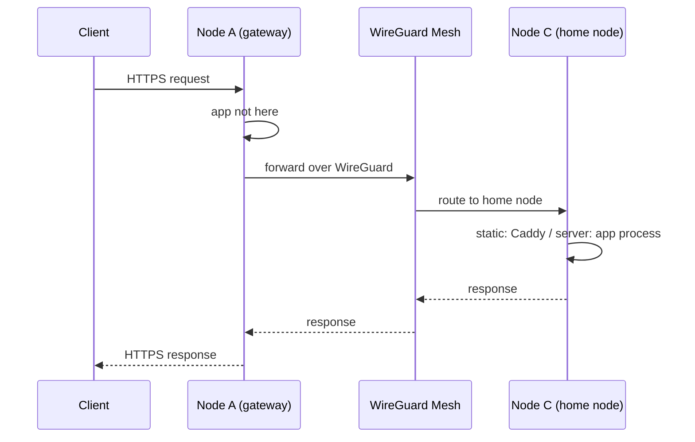
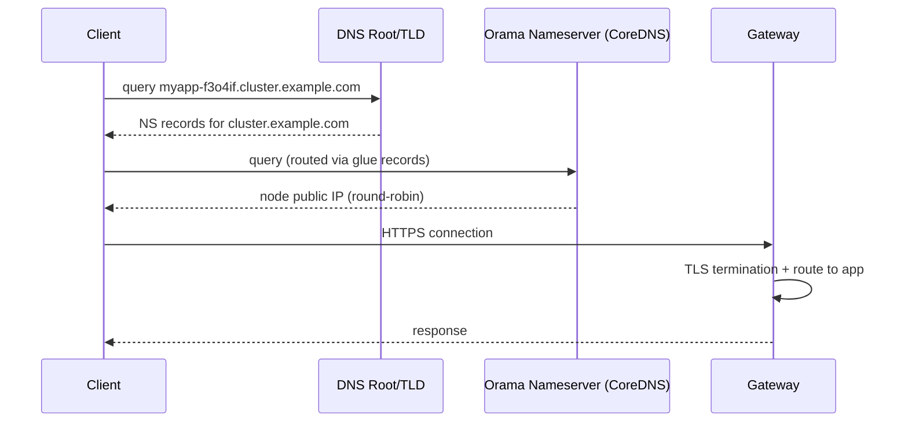

# Domains and Routing

Every deployment on the Orama Network is assigned a domain automatically. You do not need to configure DNS, provision certificates, or set up reverse proxies -- the network handles all of it.

## Automatic Domain Assignment

When you deploy an application, it receives a unique subdomain on the environment's base domain:

```
<app-name>-<random>.<base-domain>
```

For example, deploying an app named `myapp` on a cluster whose base domain is `cluster.example.com`:

```
myapp-f3o4if.cluster.example.com
```

The random suffix ensures uniqueness across all namespaces. You can also specify a custom subdomain with `--subdomain`. The base domain belongs to the cluster: its operator chose it and delegated it to the cluster's nameservers ([DNS and nameservers](/docs/operator/nameserver)). `orama env list` shows the gateway URL, whose host is the base domain.

A deployment name is 1 to 56 characters of letters, digits, `-` and `_`, starting with a letter or digit. It becomes one DNS label and part of the unit that runs it, so anything else is refused with `400`. See [Deployments](/docs/developer/deployments#names-and-limits).

The bare `<app-name>.<base-domain>` is only the address of a deployment created before subdomains existed, which has none. A deployment that has a subdomain is not served at its bare name, because names are unique per namespace and not across namespaces, so the bare host would not say whose deployment it is. If two namespaces still hold a subdomain-less deployment of the same name, the bare host answers `404` for both until one of them is deleted.

The domain is live as soon as the deployment completes. No additional configuration is required.

---

## Cross-Node Routing

Every app has a **home node** -- the node it was deployed to and where its process runs (or where its static files are served from). However, clients can reach the app through **any node** in the cluster. The gateway mesh handles routing transparently.

From the client's perspective, there is no difference between hitting the home node directly or hitting a different node that proxies the request. The response is identical.

### How Routing Works

1. The client resolves the app's domain via DNS (round-robin across nameservers)
2. The request arrives at whichever node the DNS resolved to
3. The gateway on that node resolves the deployment from the host (its subdomain, or a verified custom domain)
4. It looks up which node hosts the app
5. If the app's home node is **this node**, the gateway serves the request directly
6. If the app's home node is a **different node**, the gateway proxies the request over the WireGuard mesh to the home node



The proxy hop adds minimal latency because all inter-node traffic travels over WireGuard tunnels on the private `10.0.0.0/24` subnet. These are persistent, encrypted UDP tunnels -- no TCP handshake or TLS negotiation is required for the internal hop.

### Why This Matters

- **High availability.** If DNS resolves to any healthy node, the request succeeds regardless of where the app is hosted.
- **Simple DNS.** All nodes share the same set of domains. DNS can round-robin across all nameservers without knowing which node hosts which app.
- **Transparent to clients.** The client always talks HTTPS to a single endpoint. The internal routing is invisible.

---

## DNS Resolution Flow

Understanding how a request travels from a client's browser to your app:



Each Orama node runs **CoreDNS** as its authoritative nameserver. The domain registrar's NS records point to the Orama nodes themselves, and glue records provide the IP addresses so resolvers can reach them without a circular dependency.

### DNS record chain

```
cluster.example.com.    NS    ns1.cluster.example.com.
                         NS    ns2.cluster.example.com.
                         NS    ns3.cluster.example.com.

ns1.cluster.example.com.  A   <node-1-public-ip>    (glue record)
ns2.cluster.example.com.  A   <node-2-public-ip>    (glue record)
ns3.cluster.example.com.  A   <node-3-public-ip>    (glue record)

myapp-f3o4if.cluster.example.com.  A  <resolved-node-ip>
```

Because multiple NS records exist, DNS resolvers distribute queries across nodes. This provides both load balancing and redundancy at the DNS layer.

---

## SSL/TLS Certificates

All deployments are served over HTTPS with certificates the cluster obtains for itself from an ACME certificate authority (Let's Encrypt production by default; an operator may choose staging or another CA). You do not generate, upload or renew certificates.

The cluster holds **one certificate for the base domain and its wildcard**, which covers every single-label host under it: your deployment's name, `ns-<namespace>.<base>`, the TURN hosts and so on. It is issued with the ACME DNS-01 challenge, answered by the cluster's own CoreDNS, and kept in a store shared by every node, so a join, restart or upgrade orders nothing and renewals happen once for the cluster. Details for operators: [TLS and certificates](/docs/operator/tls-certificates).

On a cluster using Let's Encrypt **staging**, certificates are trusted by no browser. See [TLS and certificates](/docs/operator/tls-certificates#trusting-a-staging-cluster-from-your-cli).

---

## Custom Domains

You can map your own domain (like `api.example.com`) to an Orama deployment.

### CLI

```bash
# Register the domain and print the TXT record that proves you own it
orama domain add api.example.com --app my-api

# After creating the record, activate the domain
orama domain verify api.example.com --wait 5m

# Or do both in one step
orama domain add api.example.com --app my-api --verify

orama domain list                     # every domain in the namespace
orama domain list --app my-api        # one app's domains
orama domain remove api.example.com
```

Every subcommand takes `--json`. `verify --wait` re-asks the gateway every 10 seconds until the TXT record resolves or the wait runs out.

### REST API

| Method | Endpoint | Description |
|--------|----------|-------------|
| `POST` | `/v1/deployments/domains/add` | Add a custom domain to a deployment |
| `POST` | `/v1/deployments/domains/verify` | Verify domain ownership via DNS |
| `GET` | `/v1/deployments/domains/list` | List all custom domains |
| `DELETE` | `/v1/deployments/domains/remove?domain=` | Remove a custom domain (`POST` also accepted) |

`list` takes an optional `?deployment_name=` to narrow it to one app; without it, every domain in the namespace is returned. Methods are enforced -- a request with the wrong verb gets a `405` naming what the endpoint takes.

### Flow

1. Call the add endpoint with your domain and deployment name -- the response includes a verification token
2. Add a TXT record at `_orama-verify.<your-domain>` with the verification token as its value
3. Call the verify endpoint with your domain (the API will check the TXT record)
4. Point your domain's A record to your deployment's node IP
5. **No certificate is issued for custom domains.** The gateway's TLS check allows only subdomains of the cluster's base domain, so HTTPS works on your deployment's own address under the base domain, and a custom domain is served over HTTP

Adding a domain proves nothing, so it does not reserve the name. Only a **verified** domain, or a pending one of your own namespace, refuses an add (`409 Domain already in use`, the same answer whichever namespace holds it). A pending row of another namespace is replaced by your add, and a pending row expires 72 hours after it was added. If two namespaces add the same name, the last add holds the single row and only its token verifies: re-run `orama domain add` and use the token it prints.

---

## Troubleshooting

### Domain not resolving

If your app's domain does not resolve after deployment:

1. **Check deployment status.** Run `orama app get <name>` and verify the app is in a healthy state.
2. **Wait for DNS propagation.** New DNS records can take up to a few minutes to propagate, though it is usually instant.
3. **Check from multiple locations.** DNS round-robin means different resolvers may get different node IPs. Try `dig myapp-f3o4if.cluster.example.com` to see what DNS returns.

### Certificate errors

If you see a TLS certificate error in the browser:

1. **Wait a moment.** Certificate provisioning via ACME takes a few seconds after the first request to a new domain.
2. **Check the domain name.** Ensure you are using the exact domain from `orama app get <name>`.
3. **Hard refresh.** Browsers cache certificate errors aggressively. Try an incognito window or `curl -v https://your-domain`.
