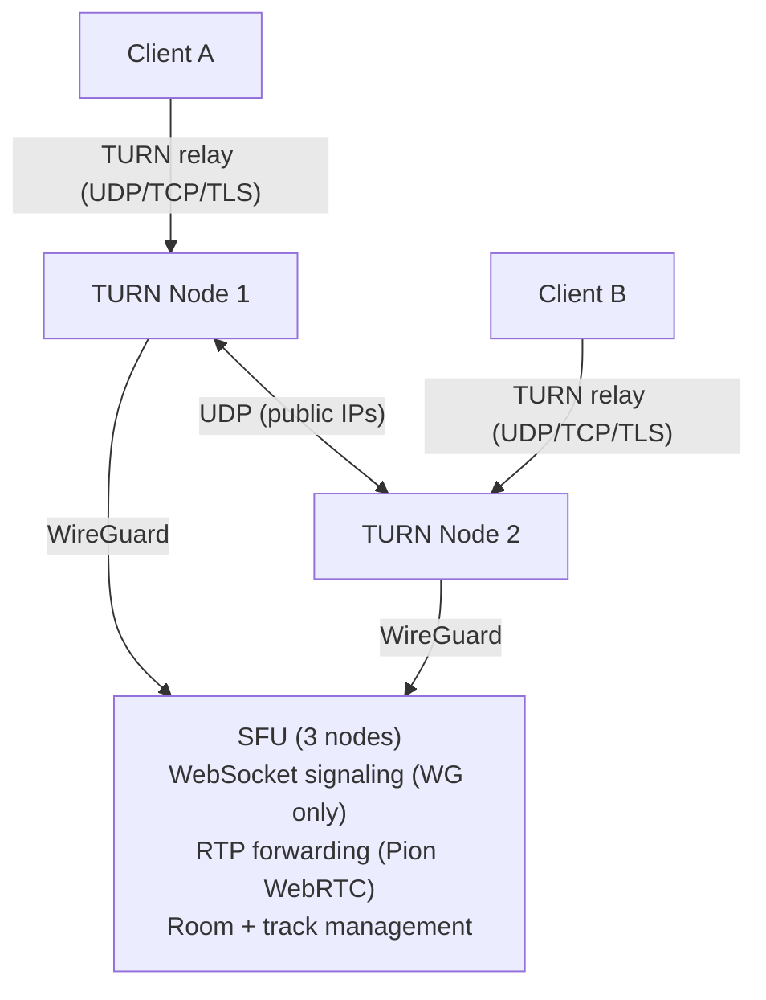

# WebRTC

Real-time voice, video, and data channels for Orama Network namespaces. Media flows through TURN relays: clients never connect directly. The SFU (Selective Forwarding Unit) handles room management, track routing, and signaling over WebSocket.

This page is for the developer who builds on a WebRTC-enabled namespace. How the services are placed, allocated and reconciled is on [WebRTC operations](/docs/operator/webrtc-operations).

## Architecture

All client media is relayed through TURN servers. The SFU binds exclusively to internal WireGuard interfaces and is unreachable from the public internet. Clients connect to TURN, TURN relays to the SFU over WireGuard.


```mermaid
graph TD
    A["Client A"] -->|"TURN relay (UDP/TCP/TLS)"| T1["TURN Node 1"]
    B["Client B"] -->|"TURN relay (UDP/TCP/TLS)"| T2["TURN Node 2"]
    T1 <-->|"UDP (public IPs)"| T2
    T1 -->|"WireGuard"| SFU["SFU (3 nodes)<br/>WebSocket signaling (WG only)<br/>RTP forwarding (Pion WebRTC)<br/>Room + track management"]
    T2 -->|"WireGuard"| SFU
```

Key properties:

- **Forced relay** — `iceTransportPolicy: "relay"` enforced server-side. No direct peer connections.
- **Namespace isolation** — Each namespace gets its own TURN secret, port ranges, and room space.
- **Redundancy** — SFU runs on all 3 nodes. TURN runs on 2 of 3 (capacity-selected).

## Enabling WebRTC

WebRTC is opt-in per namespace. The namespace must be provisioned with a ready cluster (RQLite, Olric and the gateway running), and the command runs on a cluster node because it uses the internal gateway endpoint.

```bash
# Enable
orama namespace enable webrtc --namespace myapp

# Check status
orama namespace webrtc-status --namespace myapp

# Disable (tears down the SFU, drops the namespace from the shared TURN, deallocates ports, removes DNS)
orama namespace disable webrtc --namespace myapp
```

On enable, the system generates a per-namespace TURN shared secret, allocates port blocks, spawns TURN on 2 nodes and the SFU on all 3 nodes, and creates DNS records for the TURN servers: `turn.ns-{name}.{baseDomain}` for plain UDP/TCP TURN and `turn-{name}.{baseDomain}` (a single-label host covered by the `*.{baseDomain}` wildcard certificate) for TURNS. The step-by-step enable and disable sequences are on [WebRTC operations](/docs/operator/webrtc-operations#what-happens-on-enable).

TURN is shared per host: TURN binds the fixed ports 3478/5349, which are exclusive per physical host, so every namespace allocated TURN on a node is served by that node's single `orama-turn.service`. Each namespace authenticates against its own shared secret, so tenants never share a relay identity.

## Authentication

Every WebRTC endpoint requires a **signed-in user's token**, not an API key:

```
Authorization: Bearer <access token>
```

An API key on its own is refused. WebRTC is a layer-1 route — it needs a genuine
logged-in user, or a deployed app holding its own workload token (see the technical reference's authorization chapter (`docs/whitepaper/technical-reference/vol1/14-authorization.md`, "Workload identity")) — which is what makes a runtime key extracted from an app
bundle worthless against it. The SDK gets that token by exchanging your key, or from
`auth.verify()` after a wallet signs in; `X-API-Key` and `Authorization: ApiKey`
are the deprecated spellings and are going away.

## Client Integration

### 1. Get TURN Credentials

Request TURN credentials from the gateway. They expire based on the returned `ttl` (24h for this call; the credentials the SFU hands you on the signaling socket use the shorter per-namespace TTL, 600s by default).

```typescript
const res = await fetch(
  "https://ns-myapp.cluster.example.com/v1/webrtc/turn/credentials",
  {
    method: "POST",
    headers: { Authorization: `Bearer ${accessToken}` },
  }
);

const { uris, username, password, ttl } = await res.json();
```

Response shape:

```typescript
interface TURNCredentials {
  uris: string[];       // TURN server URIs (UDP, TCP, TLS)
  username: string;     // "{expiry_unix}:{namespace}"
  password: string;     // HMAC-SHA1 derived, base64-encoded
  ttl: number;          // Seconds until expiry (86400, 24h, for this REST call)
}
```

Example `uris`:

```json
[
  "turn:turn.ns-myapp.cluster.example.com:3478?transport=udp",
  "turn:turn.ns-myapp.cluster.example.com:3478?transport=tcp",
  "turns:turn-myapp.cluster.example.com:5349"
]
```

### 2. Create PeerConnection

Use the credentials to build an `RTCPeerConnection` with relay-only transport.

```typescript
const pc = new RTCPeerConnection({
  iceServers: [{ urls: uris, username, credential: password }],
  iceTransportPolicy: "relay",
});
```

The `iceTransportPolicy: "relay"` setting is mandatory. The SFU rejects non-relay candidates server-side.

### 3. Connect Signaling WebSocket

The signaling channel is a WebSocket connection proxied by the gateway to the SFU. Pass the signed-in user's token as the `jwt` query parameter. All messages in both directions use an envelope of the form `{ type, data }`, and the first message you send must be a `join` with the `roomId` in `data`. A `userId` in it is ignored: the peer is the user the gateway authenticated. The `room` query parameter is optional but recommended: with it the gateway routes the socket straight to the SFU that owns the room; without it the gateway reads your `join` frame and routes by its `roomId`. If both are given they must match, or the join is refused with `room_mismatch`. The join frame is read to at most 4096 bytes, within 5 seconds. Room ids are 1 to 128 printable ASCII characters, and each identity may open 60 signaling sockets a minute (burst 20), after which the gateway answers 429. Rooms are created implicitly on first join.

```typescript
const ws = new WebSocket(
  `wss://ns-myapp.cluster.example.com/v1/webrtc/signal?room=${encodeURIComponent(roomId)}&jwt=${encodeURIComponent(accessToken)}`
);

ws.onopen = () => {
  ws.send(JSON.stringify({
    type: "join",
    data: { roomId },
  }));
};

ws.onmessage = (event) => {
  const msg = JSON.parse(event.data);

  switch (msg.type) {
    case "welcome":
      // msg.data: { peerId, roomId, participants }
      handleWelcome(msg.data);
      break;
    case "offer":
      handleOffer(msg.data);
      break;
    case "answer":
      handleAnswer(msg.data);
      break;
    case "ice-candidate":
      handleICE(msg.data);
      break;
    case "participant-joined":
      // msg.data: { participant: { peerId, userId } }
      handleJoin(msg.data);
      break;
    case "participant-left":
      // msg.data: { peerId }
      handleLeave(msg.data);
      break;
    case "track-added":
    case "track-removed":
      // msg.data: { peerId, userId, trackId, kind, ... }
      handleTrackChange(msg.type, msg.data);
      break;
    case "turn-credentials":
    case "refresh-credentials":
      updateTURN(msg.data);
      break;
    case "server-draining":
      reconnect();
      break;
    case "error":
      // msg.data: { code, message }
      console.error(msg.data);
      break;
  }
};
```

### 4. Handle SDP Exchange

Standard WebRTC offer/answer flow through the SFU.

```typescript
// Publishing a local track
const stream = await navigator.mediaDevices.getUserMedia({
  audio: true,
  video: true,
});

for (const track of stream.getTracks()) {
  pc.addTrack(track, stream);
}

const offer = await pc.createOffer();
await pc.setLocalDescription(offer);

ws.send(JSON.stringify({ type: "offer", data: { sdp: offer.sdp } }));

// Handle answer from SFU
function handleAnswer(data: { sdp: string }) {
  pc.setRemoteDescription({ type: "answer", sdp: data.sdp });
}

// Exchange ICE candidates
pc.onicecandidate = ({ candidate }) => {
  if (candidate) {
    ws.send(JSON.stringify({
      type: "ice-candidate",
      data: {
        candidate: candidate.candidate,
        sdpMid: candidate.sdpMid,
        sdpMLineIndex: candidate.sdpMLineIndex,
      },
    }));
  }
};

function handleICE(data: RTCIceCandidateInit) {
  pc.addIceCandidate(data);
}
```

### 5. Handle Remote Tracks

The SFU forwards tracks from other participants.

```typescript
pc.ontrack = (event) => {
  const [stream] = event.streams;
  const video = document.createElement("video");
  video.srcObject = stream;
  video.autoplay = true;
  document.getElementById("remote-videos")?.appendChild(video);
};
```

### 6. Handle Credential Refresh

The SFU sends refreshed TURN credentials at 80% of the credential TTL (8 minutes for the default 600s SFU credential TTL). Update the ICE configuration without renegotiating.

```typescript
function updateTURN(data: TURNCredentials) {
  const config = pc.getConfiguration();
  config.iceServers = [
    { urls: data.uris, username: data.username, credential: data.password },
  ];
  pc.setConfiguration(config);
}
```

### 7. Handle Server Draining

When an SFU node is shutting down (during upgrades), it sends a `server-draining` message. Reconnect to another node.

```typescript
function reconnect() {
  ws.close();
  // Re-establish signaling connection — the gateway routes to an available SFU
  const newWs = new WebSocket(
    `wss://ns-myapp.cluster.example.com/v1/webrtc/signal?room=${encodeURIComponent(roomId)}&jwt=${encodeURIComponent(accessToken)}`
  );
  // Re-attach handlers and send a new join message on open...
}
```

## Room Management

There is no REST API for creating or closing rooms. A room exists once the first peer joins it over the signaling WebSocket, and an empty room is cleaned up by the SFU 60 seconds after its last peer leaves (`emptyRoomTTL`). `GET /v1/webrtc/rooms` is the only room route and is read-only: it relays the health answer (status and room count) of the SFU on the gateway's own node, 503 if that SFU does not answer, and any other method is refused with 405. Which SFU owns a room is decided as described in [Room placement](/docs/operator/webrtc-operations#room-placement).

```typescript
const headers = {
  Authorization: `Bearer ${accessToken}`,
};

// Get room information (proxied to the SFU health endpoint)
const rooms = await fetch("https://ns-myapp.cluster.example.com/v1/webrtc/rooms", {
  headers,
}).then((r) => r.json());
```

## REST Endpoints

| Method | Path | Auth | Description |
|--------|------|------|-------------|
| POST | `/v1/webrtc/turn/credentials` | Signed-in user token | Get TURN relay credentials |
| GET/WS | `/v1/webrtc/signal` | Signed-in user token | WebSocket signaling |
| GET, PUT | `/v1/webrtc/config` | Namespace settings grant (owner, admin) | The namespace's WebRTC policy: `{"require_admission": bool}` (see "Admission") |
| GET | `/v1/webrtc/rooms` | Signed-in user token | The local SFU's health, with its room count; any other method is a 405 |

## Signaling Messages

Messages exchanged over the WebSocket signaling channel. Every message is an envelope `{ type, data }` with the payload under `data`.

### Client to SFU

| Type | Data payload | Description |
|------|--------------|-------------|
| `join` | `{ roomId }` | Join a room (must be the first message; a `userId` is ignored) |
| `offer` | `{ sdp }` | SDP offer |
| `answer` | `{ sdp }` | SDP answer |
| `ice-candidate` | `{ candidate, sdpMid, sdpMLineIndex }` | ICE candidate |
| `leave` | — | Leave a room |
| `audio-state`, `video-state` | `{ enabled }` | The client turned its audio or video on or off (see "Audio and video state") |

### SFU to Client

| Type | Data payload | Description |
|------|--------------|-------------|
| `welcome` | `{ peerId, roomId, participants }` | Join confirmed, with current participants |
| `offer` | `{ sdp }` | SDP offer (for subscribing to new tracks) |
| `answer` | `{ sdp }` | SDP answer |
| `ice-candidate` | `{ candidate, sdpMid, sdpMLineIndex }` | ICE candidate |
| `participant-joined` | `{ participant: { peerId, userId } }` | New participant entered the room |
| `participant-left` | `{ peerId }` | Participant left the room |
| `track-added` | `{ peerId, userId, trackId, streamId, kind }` | A new track is available |
| `track-removed` | `{ peerId, userId, trackId, kind }` | A track was removed |
| `turn-credentials` | `{ username, password, ttl, uris }` | Initial TURN credentials on connect |
| `refresh-credentials` | `{ username, password, ttl, uris }` | Refreshed TURN credentials (sent at 80% TTL) |
| `server-draining` | `{ reason, timeoutMs }` | SFU shutting down, reconnect to another node |
| `participant-state` | `{ peerId, userId, kind, enabled }` | Another participant's audio or video state, or a mute the namespace applied |
| `kicked` | `{ code }` | The SFU removed you from the room and closes the socket. `code` is `removed` (the namespace kicked you) or `admission_expired` (the admission you joined on ended) |
| `error` | `{ code, message }` | Signaling error |

### Negotiation: offer glare and the polite SFU

The SFU offers whenever it has something to tell a client (a track to subscribe to, a track removed, an
ICE restart) and the client offers when it publishes, so both can offer at once ("glare"). The SFU is
the **polite** peer, so a client does not have to implement rollback (iOS WebRTC's breaks audio): if a
client `offer` arrives while the SFU's own offer is outstanding, the SFU withdraws its own, answers the
client's, and offers again once that is done, with everything the withdrawn offer carried. The client
treats it as normal perfect negotiation with itself impolite: ignore an SFU `offer` that arrives while
its own is outstanding, and apply the SFU's next one after the SFU's `answer`. No `offer_failed` is
sent for a glare.

Details a client can observe:

- Every SDP exchange of one peer is serialized in the SFU, so an offer and an answer never interleave.
- The SFU gives its own m-lines mids of the form `sfu<N>` (`sfu1`, `sfu2`, ...), never numeric ones, so
  a mid the client picks for a new m-line of its own can never collide with one the SFU picked in an
  offer the client has not seen. Do not assume numeric mids or contiguous mids.
- pion (the SFU's WebRTC stack, v4.2.22) has no rollback: its signaling state machine allows leaving
  `have-local-offer` only through an answer. The SFU therefore yields by answering its own outstanding
  offer with a stand-in answer that accepts it unchanged and carries the client's ICE credentials and
  DTLS fingerprint (`pkg/sfu/glare.go`), then applies the client's offer. When pion grows rollback,
  `yieldToClientOfferLocked` becomes a `SetLocalDescription(rollback)`.
- The stand-in answer also fixes the DTLS role when glare hits before any answer did (the very first
  SFU offer). The role is derived, not fixed: once a negotiation completed the stand-in keeps the
  established role; on the first one it follows the client's crossing offer: `a=setup:actpass` or
  `passive` makes the SFU the DTLS client (stand-in `passive`), `a=setup:active` makes the SFU the DTLS
  server (stand-in `active`), so the SFU's later answer to that offer agrees (`standInSetup`).

### Signaling rate limit

Each peer has a signaling allowance (`pkg/sfu/ratelimit.go`), because an `offer` or an `ice-candidate`
makes the SFU do work and a client that offers without ever answering makes it build a throwaway
PeerConnection per glare. Offers and ICE candidates share one token bucket (burst 40, refilled at 10
per second), and a peer may make the SFU yield its own offer to glare at most 6 times per minute. A peer
that exceeds either gets an `error` frame with code `rate_limited` and its socket is closed; it can
rejoin. Ordinary negotiation, including trickle ICE on connect, stays well inside the allowance.

### Keyframes (PLI/FIR)

A subscriber that needs a keyframe (it joined mid-stream, or lost packets) sends PLI or FIR on the
`RTPSender` of the track it receives. The SFU reads that RTCP for every subscribed track and relays a
PLI to the publisher of the track. PLIs for one track are at least 500 ms apart
(`keyframeMinInterval`): a request inside the interval is deferred to its end, and requests that arrive
while one is deferred share it, so N subscribers cost the publisher one keyframe per interval, not N.
After a subscriber joins, the SFU also asks the publishers of the video tracks it was given for a
keyframe once its negotiation has settled (300 ms). Reading the senders' RTCP also drains their RTCP
buffers, which the NACK responder needs.

### Signaling socket failover

`/v1/webrtc/signal` reaches the namespace through the cluster gateway, which picks one of the
namespace's gateways. If the dial to that member fails (its gateway is restarting, its node is down)
nothing was sent, so the cluster gateway tries the next member whose circuit breaker allows it, exactly
as for an HTTP request. Any namespace gateway can serve the upgrade: each one routes the room to the SFU
that owns it (see Room Placement). A tunnel that was established and then ended is not retried.

When no member can be dialed the client gets HTTP `503` with the typed envelope

```json
{"ok": false, "error": {"code": "NAMESPACE_GATEWAY_UNAVAILABLE", "message": "...", "retryable": true}}
```

and should reconnect with backoff. A WebSocket route that has only one backend (not a namespace
gateway) answers a failed dial with `SERVICE_UNAVAILABLE`, also `retryable`.

### Peer lifecycle

A peer ends exactly once, whichever side ends it: the signaling socket closing, `leave`, ICE failing,
ICE not recovering within 15 s of `disconnected`, or a signaling write failing. Ending it releases the
PeerConnection (and with it the TURN allocation), the socket, and the goroutines tied to the peer.
Signaling writes have a 5 s deadline (`wsWriteTimeout`) and are made outside the room's lock, so a
client that stopped reading is disconnected after 5 s and does not stall the room. One subscriber's
failing RTP write never stops the forwarding of a track to the others.

## Identity, admission and moderation

A room's participants are the users the namespace's gateway authenticated, a namespace can decide who may
join, and its functions can remove or mute a participant. None of it is in the client's hands: the SFU
takes every one of these decisions from a ticket the namespace's gateway signs, never from a frame the
client sends.

### Identity

The peer's identity in a room is the **subject of the token the gateway authenticated** (a wallet, or a
deployed app's workload) and, when the session is bound to a device, the **device id** (the `did` claim).
They are what `welcome`, `participant-joined`, `track-added` and the membership events name
(`userId`, `deviceId`).

The `userId` in the client's `join` frame is **ignored** (and no longer required): a client cannot say who
it is. A client that kept sending one sees the authenticated id come back instead.

How the SFU can trust it: the SFU listens on the WireGuard overlay, where every namespace's services are, so
being on the overlay proves nothing. The namespace gateway signs a **join ticket** (`pkg/sfu/ctrlauth`) and
sends it to the SFU in the `X-Orama-SFU-Ticket` header of the signalling upgrade: the namespace, the room,
the user, the device, whether the user is muted, the gateway's event address, an issue time and an expiry
30 seconds out, under an HMAC-SHA256 key. The key is HKDF-derived (purpose `webrtc-sfu-control`) from the
namespace's own TURN secret, which the gateway and the SFU both already hold and no end user does, so one
namespace's SFU can neither accept another's ticket nor report into it. The gateway deletes whatever the
client sent under that header before it sets its own. The SFU refuses an upgrade with no ticket, a bad MAC,
an expired ticket, or a ticket for another namespace (HTTP `401`/`403`), and a `join` for any room but the
ticket's (`room_mismatch`).

**Rolling upgrade.** An upgraded SFU refuses a ticketless upgrade, and placement does not know versions: a
gateway that has not been upgraded yet can route a room (by rendezvous rank, or because the room already
lives there) to an upgraded node's SFU, and that join gets `401` with no ticket to present. So until every
node of the namespace is upgraded, **some joins fail**, not only the joins that land on a node not yet
upgraded: any join whose room is placed on an upgraded SFU through an old gateway does. The failure is a
clean refusal and the client's retry lands once the gateway is upgraded; there is no state to repair. Upgrade
the namespace's nodes one at a time, as the rolling-upgrade procedure does, and do not judge the namespace
healthy mid-upgrade by joins alone. The same holds for the control calls (kick, mute) and the membership
events: an old SFU does not serve `/admin/kick` or `/admin/mute`, so a kick made from an upgraded gateway
fails for that SFU (the revocation stands) until it is upgraded too.

### Admission

By default every signed-in user with the `webrtc` grant may join any room. A namespace can instead **require
admission**:

```bash
# the namespace's settings credential (an owner or admin session)
curl -X PUT https://ns-myapp.cluster.example.com/v1/webrtc/config \
  -H "Authorization: Bearer $ADMIN_TOKEN" -d '{"require_admission": true}'
curl https://ns-myapp.cluster.example.com/v1/webrtc/config -H "Authorization: Bearer $ADMIN_TOKEN"
# {"require_admission":true}
```

With it on, a join succeeds only if the namespace's functions admitted that user to that room, and the
admission is still good. A function admits with the `webrtc_admit` host function
([Functions](/docs/developer/functions#host-functions-api)):

```
webrtc_admit(room, user, device, ttl_seconds) -> {"room","user_id","device_id","expires_at"}
```

- `user` is the authenticated subject the user will join as (the `subject` of their session).
- `device` is empty to admit the user from any device, or a device id to admit that device only. A session
  bound to no device is matched only by an admission with no device.
- `ttl_seconds` is 1 to 86400 (24 hours). Admitting again extends the admission and lifts a revocation, and
  keeps a mute on record: an expired admission that carries a mute is kept for 7 days after it expires, so
  admitting the user again within that time does not unmute them. After 7 it is purged, which bounds the table,
  and a user admitted again then starts unmuted; a function that needs a longer mute calls `webrtc_mute` again.

**The admission's end holds for a live session.** The join ticket carries the unix second the admission it
was issued on ends, and the SFU removes the peer then: it is sent `kicked` with `data.code`
`admission_expired`, its socket and PeerConnection are closed, and the leave event's `reason` is `expired`.
Admitting again before then does **not** lengthen a session already open (it is bound by the ticket it joined
with); the client rejoins to pick up the new end, so a function that extends admissions should do it with
enough margin for the client to reconnect. A namespace that does not require admission has no end to hold.

**What each setting changes, and when.** Turning `require_admission` on or off changes **new joins** only:
a user already in a room stays in it (turning it on does not remove users who were never admitted; kick them),
and one who joined while it was off has no admission end to be held to. A gateway reads the policy on every
join, so the change is seen by all gateways at once.

**Clocks.** The gateway and the SFU compare clocks: the ticket's expiry (30 seconds) is judged by the SFU's
clock, so a gateway whose clock is **more than 30 seconds behind** the SFU's issues tickets the SFU finds
already expired, and every join through it is refused (`401`). Keep the nodes' clocks synchronised; a request
MAC (kick, mute, membership event) tolerates 60 seconds either way. See "Kick and mute" for how kicks cope
with a skew of up to 10 seconds between gateways.

A join that is not admitted is refused before it reaches an SFU, with a typed error that names why:

| Why | `?room=` upgrade (HTTP 403) `error.code` | Join frame without `?room=` (error frame `code`) |
|-----|---------|---------|
| Never admitted to this room, or as this user or device | `WEBRTC_ADMISSION_REQUIRED` | `admission_required` |
| The admission has expired | `WEBRTC_ADMISSION_EXPIRED` | `admission_expired` |
| A function revoked it (`webrtc_kick`) | `WEBRTC_ADMISSION_REVOKED` | `admission_revoked` |
| The admission records cannot be read | `SERVICE_UNAVAILABLE` (503, retryable) | `admission_unavailable` |
| The admission tables are not the ones migrations 073 and 075 make | `INTERNAL` (500, not retryable) | `admission_unavailable` |

A gateway that cannot read the records refuses the join; it never admits on a guess.

**A table that was there first.** Migration 073 creates `webrtc_settings` and `webrtc_admissions` with
`IF NOT EXISTS`, so a namespace whose own database already had a table of either name (its own, from before
the platform used the name) keeps it. The gateway therefore checks both tables the first time it uses them
(and again after a failure): every column must exist and the primary key must be exactly the migration's. A
table that does not match is refused with an error naming the table, the missing columns or key, and the
fix (rename or drop the tenant's table and re-apply the migration), on the join path, in `webrtc_admit`,
`webrtc_kick`, `webrtc_mute` and the settings route alike. Nothing reads or writes a table that is not the
admission table. A table that does not exist at all (the migration has not reached the database yet) is the
retryable `admission_unavailable`. The platform's own `webrtc_admissions` that lacks only `generation` is
reported as migration 075 not applied yet, not as a foreign table: the namespace gateway applies 075 when it
starts, and the next join checks again.

Where it lives: the policy (`webrtc_settings`) and the admissions (`webrtc_admissions`) are tables of the
**namespace's own database** (migrations 073 and 075), checked by whichever namespace gateway takes the join. They
are the tenant's own policy and grants, so no cluster-wide write sits on the join path; no SFU holds any of
it, so it survives an SFU restart and is the same whichever node owns the room. A namespace that never turns
the policy on keeps today's behaviour; the identity rule above applies either way.

### Membership events

The SFU reports every join and leave to the namespace, which publishes it on the pubsub topic
**`_orama/webrtc/<room>`**. Functions (a pubsub trigger on `_orama/webrtc/*`) and clients (a subscription to
the topic) read it like any topic:

```json
{"_orama":"webrtc.join","room":"standup","user_id":"0xabc...","device_id":"<did or absent>","peer_id":"<uuid>","at":"2026-10-06T10:00:00.123Z"}
{"_orama":"webrtc.leave","room":"standup","user_id":"0xabc...","peer_id":"<uuid>","reason":"left","at":"..."}
```

`reason` on a leave is `left` (the client left, or its connection failed), `kicked`, `expired` (the
admission the peer joined on ended), or `closed` (the SFU shut the room down). A user connected from two devices has two peers and two events. The `_orama` key is the
platform's: the pubsub publish routes refuse a payload carrying it (`PUBSUB_RESERVED_KEY`), so a subscriber that
sees it knows the platform wrote the message and not an end user. Trust `_orama` on these topics, not the
topic name.

**The topic is reserved.** Everything under `_orama/` is the platform's. No publish route accepts it, from any
caller: `POST /v1/pubsub/publish`, `publish-batch` and a frame on a pubsub WebSocket are all refused
(`403`, `PUBSUB_RESERVED_TOPIC`; a WebSocket on the topic is read-only and `presence` on it is refused). The
platform publishes these in-process. **Subscribing** needs a grant: a signed-in user who holds no grant in
the namespace (the end user of an application) can read pub/sub topics in general, but not these, because
they say who is in rooms that user was not admitted to; they are refused (`403`, `PUBSUB_RESERVED_TOPIC`) and
left out of `GET /v1/pubsub/topics`. A caller holding a grant (an API key of role `runtime` or above, or a
wallet with a pubsub grant covering the topic) may subscribe. The exact set is the credentials that can
**write** pub/sub on the topic: a wallet with a pubsub write grant that covers `_orama/webrtc/<room>` (a grant
narrowed to other topics does not), an API key of role `runtime` or any higher role (`developer`, `admin`,
`owner`). **Runtime keys are shipped inside applications**, so anyone who has the application has one: an
application that needs membership to stay private from its users keeps it behind functions and does not ship a
runtime key. An application that wants its end users to see a room's participants republishes what it chooses
from a function on a topic of its own. Functions themselves subscribe to the topic through a pubsub trigger
and the `ws_pubsub_bridge` host function, which run as the namespace and are not narrowed. **Bridging the
membership topic to end users is the application's decision:** a function that passes user input as the
`ws_pubsub_bridge` topic exposes the membership of every room to that user, so a function that bridges for a
user fixes the topic itself (`_orama/webrtc/` plus a room that user was admitted to) and never takes it from
the request. See the technical reference's authorization chapter (`docs/whitepaper/technical-reference/vol1/14-authorization.md`, "Pub/sub reserved topics").

How they travel: each ticket names the issuing gateway's overlay address; the SFU posts the event to it
(`POST /v1/internal/webrtc/events`, a MAC under the same namespace key) and the gateway publishes. The SFU
keeps the gateways it has recently seen tickets from and delivers to the most recently seen one that
answers, because the gateway a socket came through dies together with the socket and could not receive its
own peers' leaves. Events from one SFU are delivered in order. A gateway that answers and **refuses** an event
(a bad MAC) is not routed around: that is a misconfiguration, and the SFU logs an error naming it. Delivery
is at most once: when no gateway answers, the event is dropped and the SFU's log says so; a subscriber can
resynchronise from the `participants` list of a `welcome`.

### Kick and mute

Two host functions act on a participant ([Functions](/docs/developer/functions#host-functions-api)):

- `webrtc_kick(room, user)` **revokes** every admission of `user` to `room` and removes their connection:
  every device they are connected from is sent `kicked` and its socket and PeerConnection are closed
  (a `leave` event with reason `kicked` follows). The rejoin with the revoked admission is refused
  (`WEBRTC_ADMISSION_REVOKED`) until a function admits them again. A join whose ticket was issued before the
  kick but arrives after it is refused too, including one whose join frame the client had not yet sent when
  the kick landed (the SFU checks the kick log again once the peer is in the room, and removes it if it is
  refused). Every admission takes the next **generation** of its user in its room (1 for the first, one more on every admit, across devices: it only
  grows), the join ticket carries the generation of the admission it was issued on, and the kick carries the
  newest generation it revoked. The SFU refuses a ticket whose generation is **not newer than the kick's**, and
  no clock is involved: a user re-admitted right after a kick holds a ticket of a newer generation and joins at
  once, and a ticket of the revoked admission stays out whatever its gateway's clock says. The SFU remembers a
  kick for a ticket's life plus a 10 second margin. Where either side has no generation (a namespace that does
  not require admission, an admission made before generations existed, a kick or ticket from a gateway that has
  not been upgraded) it falls back to the clocks: any ticket for that user and room that reaches this SFU inside
  that window is refused, unless its issue time is more than the margin later than the kick's, so there a user
  re-admitted within about 10 seconds of a kick may be refused once and rejoins. An ended admission is kept
  for a minute so the count survives it. Without
  `require_admission` there is no admission to revoke: the kick closes the live connection and the user may
  rejoin.
- `webrtc_mute(room, user, muted)` makes the SFU stop forwarding `user`'s **audio** (every audio track they
  publish, checked per packet on the server, so a modified client that keeps sending is still silent), and
  tells the room with a `participant-state` frame carrying `"forced": true`. It is recorded on the user's
  admissions, so the user is still muted when they rejoin; `muted = false` resumes it. With no admission on
  record (a namespace that does not require admission, a user it never admitted) the mute lasts as long as
  that connection, plus the window below.

**A mute is logged on the SFU like a kick.** A join ticket carries the mute state the gateway read when it
issued it, a snapshot of at most 30 seconds. Each SFU therefore keeps the latest mute or unmute of a user in a
room (the request carries the gateway's clock, `at_ms`) for a ticket's life plus the 10 second margin, and a
join whose ticket was issued at or before that change (plus the margin) takes the logged state instead of
the ticket's: a user holding an unmuted ticket minted before the mute is muted when they reconnect, a join in
flight when the mute lands ends muted (the SFU applies the log once the peer is in the room), and a user
unmuted after a muted ticket was minted is unmuted. A ticket issued after the change is authoritative. A late
request older than the one on record is ignored. Unlike a kick this is judged by the gateways' clocks alone,
with no generation: a mute is a state, not a revocation, and a re-admission keeps it, so a ticket issued just
after a mute and corrected to the logged state still ends in the state the namespace last set. The peer is told with the same forced `participant-state`
frame, after its `welcome`.

Both are sent to **every SFU of the namespace**, not only the room's owner: placement is decided by health
probes, so an SFU that missed one while it hosted the room would be passed over and the call would land on one
that has no such peer, and the kick would silently do nothing. Every SFU keeps its own kick log, so every SFU
is told, over the overlay, with a request MAC (the target's address, method, path, timestamp, a random nonce
and the body hash: a captured request replays onto nothing else, not onto another SFU or gateway of the
namespace even though they share the key, and the SFU, like the gateway's events route, remembers the MACs it
served for the length of their validity and refuses a second use, `401`). The target is the receiver's
signalling address (`host:port`, the SFU's `listen_addr`) for a control request and the gateway's event address
(the one its tickets carry) for a membership event; each receiver verifies against its own, so a stamp made for
another is refused. The MAC changed in this release (`orama-sfu-control-v2`): an SFU and a gateway on
different releases refuse each other's kicks, mutes and events, so upgrade the namespace's nodes together. The generation (migration 075, a column the namespace's gateways add on start) crosses releases safely: an older SFU ignores the extra field of a ticket or kick and judges by the clocks, and an upgraded SFU takes a ticket or kick without one the same way. The database change comes first: if
any SFU cannot be reached or refuses, the host function fails, names each such SFU, and says the revocation
(or mute) is recorded but not every connection was closed; the SFUs that could be reached did act, and
repeating it is safe. Both act on the gateway's own namespace and on no other: a call naming another
namespace is refused before anything is recorded or sent.

### Audio and video state

A client tells the room its microphone or camera went on or off:

```json
{"type":"audio-state","data":{"enabled":false}}
{"type":"video-state","data":{"enabled":true}}
```

The SFU relays it to the **other** participants as
`{"type":"participant-state","data":{"peerId","userId","kind":"audio"|"video","enabled":bool}}`. The state is
for the others' interfaces: the SFU does not act on it (the media shows whether a track is live), and it is
not kept for late joiners, who learn state from the frames that follow their join. A frame without a boolean
`enabled` is answered `invalid_state`. (Both used to be answered `unknown_message`.)

## TURN Credential Protocol

- Credentials use HMAC-SHA1 with a per-namespace shared secret
- Username format: `{expiry_unix}:{namespace}`
- Password: `base64(HMAC-SHA1(shared_secret, username))`
- One-shot REST / `turn_credentials` host-fn TTL: 24h (`turn.DefaultCredentialTTL`).
  These paths mint once at call setup and are never refreshed, so the credential
  must outlast the whole call — a short TTL tore down relay-only media at expiry.
- SFU signaling path TTL (credentials the SFU hands to clients): per-namespace
  `turn_credential_ttl` (default 600s). The SFU proactively sends `refresh-credentials`
  over the signaling WebSocket at 80% of TTL (the initial credential arrives as
  `turn-credentials`), so a short TTL is safe there.
- The SFU's own PeerConnection (relay-only) authenticates to TURN with a credential
  of its own that never leaves the SFU: 24h (`turn.DefaultCredentialTTL`), independent
  of `turn_credential_ttl`. pion's TURN client refreshes its allocation with the
  credential it was created with and the TURN server rejects an expired one, and
  `SetConfiguration` only affects the next ICE gathering, never an existing
  allocation. So at 80% of that lifetime (19.2h, `sfuTURNRefreshInterval`) the SFU
  swaps in a fresh credential (`SetConfiguration`) and sends the client an offer with
  an ICE restart, which gathers a new allocation authenticated with it. A session
  therefore never outlives its relay credential. If the swap fails the peer is
  disconnected so the client rejoins on a fresh credential, instead of a call whose
  media silently stops.
- Clients should update ICE servers on receiving `refresh-credentials`

## TURNS TLS Certificate

TURNS (port 5349) uses TLS and the client connects to the single-label host
`turn-{name}.{baseDomain}`. The shared TURN server presents the cluster's
`*.{baseDomain}` wildcard cert (the one Caddy serves for HTTPS), which covers
every tenant's single-label TURNS host and stealth host, so browsers validate
it. Caddy keeps it in the cluster's shared certificate store, and the cluster
gateway exports it to `/opt/orama/.orama/data/tls/wildcard.{crt,key}`
([Architecture](/docs/contributor/architecture-reference#tlshttps)), where TURN reads it.

There is no other source. If the wildcard is not exported yet, TURNS stays off and
the node logs why; clients keep plain TURN on 3478. A self-signed cert is never
served — browsers reject it, and for a stealth host a rejected cert is
indistinguishable from being blocked. The two-label host
`turn.ns-{name}.{baseDomain}` is not covered by the wildcard, which is why
TURNS uses the single-label host.

Caddy renews the certificate once for the cluster, with about a third of its lifetime left; the cluster gateway exports the renewal within a minute. TURN serves the cert through a hot-reloading `GetCertificate` callback that polls the cert file every 60 seconds, so renewed certs are picked up in-process without a restart (a restart would drop every active relay).

## Full Example

A minimal working example connecting two peers in a room.

```typescript
async function joinRoom(roomId: string, accessToken: string) {
  // 1. Get TURN credentials
  const creds = await fetch(
    "https://ns-myapp.cluster.example.com/v1/webrtc/turn/credentials",
    { method: "POST", headers: { Authorization: `Bearer ${accessToken}` } }
  ).then((r) => r.json());

  // 2. Create PeerConnection
  const pc = new RTCPeerConnection({
    iceServers: [
      { urls: creds.uris, username: creds.username, credential: creds.password },
    ],
    iceTransportPolicy: "relay",
  });

  // 3. Get local media
  const stream = await navigator.mediaDevices.getUserMedia({
    audio: true,
    video: true,
  });
  for (const track of stream.getTracks()) {
    pc.addTrack(track, stream);
  }

  // 4. Handle remote tracks
  pc.ontrack = (event) => {
    const [remoteStream] = event.streams;
    const video = document.createElement("video");
    video.srcObject = remoteStream;
    video.autoplay = true;
    document.getElementById("remote-videos")?.appendChild(video);
  };

  // 5. Connect signaling
  const ws = new WebSocket(
    `wss://ns-myapp.cluster.example.com/v1/webrtc/signal?room=${encodeURIComponent(roomId)}&jwt=${encodeURIComponent(accessToken)}`
  );

  ws.onopen = async () => {
    // First message must be a join with the roomId in data (a userId is ignored)
    ws.send(JSON.stringify({ type: "join", data: { roomId } }));

    const offer = await pc.createOffer();
    await pc.setLocalDescription(offer);
    ws.send(JSON.stringify({ type: "offer", data: { sdp: offer.sdp } }));
  };

  pc.onicecandidate = ({ candidate }) => {
    if (candidate) {
      ws.send(JSON.stringify({
        type: "ice-candidate",
        data: {
          candidate: candidate.candidate,
          sdpMid: candidate.sdpMid,
          sdpMLineIndex: candidate.sdpMLineIndex,
        },
      }));
    }
  };

  ws.onmessage = (event) => {
    const msg = JSON.parse(event.data);

    switch (msg.type) {
      case "answer":
        pc.setRemoteDescription({ type: "answer", sdp: msg.data.sdp });
        break;
      case "ice-candidate":
        pc.addIceCandidate(msg.data);
        break;
      case "offer":
        pc.setRemoteDescription({ type: "offer", sdp: msg.data.sdp }).then(async () => {
          const answer = await pc.createAnswer();
          await pc.setLocalDescription(answer);
          ws.send(JSON.stringify({ type: "answer", data: { sdp: answer.sdp } }));
        });
        break;
      case "refresh-credentials":
        const config = pc.getConfiguration();
        config.iceServers = [
          { urls: msg.data.uris, username: msg.data.username, credential: msg.data.password },
        ];
        pc.setConfiguration(config);
        break;
      case "server-draining":
        // Reconnect logic
        break;
    }
  };

  return { pc, ws, stream };
}
```

## Data Channels

WebRTC data channels work through the same SFU relay path. Create a data channel before generating the offer.

```typescript
const dc = pc.createDataChannel("app-data", { ordered: true });

dc.onopen = () => {
  dc.send(JSON.stringify({ action: "cursor-move", x: 100, y: 200 }));
};

dc.onmessage = (event) => {
  const data = JSON.parse(event.data);
  // Handle incoming data channel messages
};

// On the receiving side
pc.ondatachannel = (event) => {
  const channel = event.channel;
  channel.onmessage = (e) => {
    const data = JSON.parse(e.data);
    // Handle incoming messages
  };
};
```

## Security Model

- **Forced relay**: `iceTransportPolicy: relay` enforced server-side. Clients cannot bypass TURN.
- **HMAC credentials**: Per-namespace TURN shared secret. REST/host-fn credentials expire after 24h (long enough to outlast any call, since they are not refreshed mid-call); SFU-signaled credentials use the shorter per-namespace TTL and are refreshed over the signaling channel.
- **Namespace isolation**: Each namespace has its own TURN secret, port ranges, and rooms.
- **A logged-in user, not a key**: every WebRTC endpoint requires a wallet token, or a deployed app's own workload token (`Authorization: Bearer`). An API key alone is refused, which is what makes a runtime key extracted from an app bundle worthless here. On the signalling WebSocket the token goes in `?jwt=`, because a browser cannot set a header on an upgrade (`?token=` is read as an API key, which these endpoints refuse).
- **Identity and admission**: a peer is the user the gateway authenticated, carried to the SFU in a short-lived ticket signed with a key derived from the namespace's TURN secret; a namespace may admit only the users its functions admitted (see "Identity, admission and moderation").
- **Room lifecycle**: there is no create/close API. A room is created by its first join (which needs an authenticated user and, if the namespace requires admission, an admitted one) and removed by the SFU 60 seconds after it empties.
- **Known limit**: TURN credentials are namespace-wide and cannot be revoked per user.
- **SFU on WireGuard only**: SFU binds to 10.0.0.x, never 0.0.0.0. Only reachable via TURN relay.
- **Permissions-Policy**: `camera=(self), microphone=(self)` — only same-origin can access media devices.

## Firewall

When WebRTC is enabled, the following ports are opened via UFW on TURN nodes:

| Port | Protocol | Purpose |
|------|----------|---------|
| 3478 | UDP | TURN standard |
| 3478 | TCP | TURN TCP fallback (for clients behind UDP-blocking firewalls) |
| 5349 | TCP | TURNS — TURN over TLS (encrypted, works through strict firewalls/DPI) |
| 443 | TCP | Stealth TURNS: the SNI router hands TURN-over-TLS clients to the namespace's TURNS listener ([Stealth TURN](/docs/operator/stealth-turn)); open already for HTTPS |
| 49152-65535 | UDP | TURN relay range (allocated per namespace) |

SFU ports are NOT opened in the firewall — they are WireGuard-internal only.
