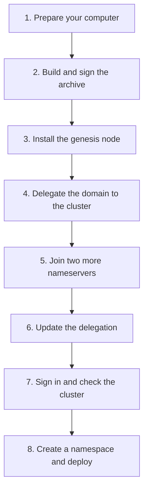

# Install a cluster from scratch

This is the whole path from three empty servers and a domain to a working cluster with an app running on it. Follow it in order. After every stage there is a **Check** that tells you whether to carry on, and **If it fails** with the usual causes.

Read [What you need](/docs/operator/getting-started) first. Everything below is typed on your own computer. You never log in to a server yourself.

## The plan



The order matters for one reason: a joining node pins the genesis node's TLS certificate, and that certificate cannot be issued until the internet can find your nameservers. So the domain is delegated **after** the genesis node and **before** anyone joins.

## Names used on this page

| Placeholder | Meaning |
|---|---|
| `mycluster` | The name the CLI gives your cluster (an *environment*). Any name you like |
| `cluster.example.com` | Your base domain |
| `203.0.113.10`, `.11`, `.12` | Public IPs of your three servers |
| `$ARCHIVE` | The path `orama maint build` prints. If you install a published release instead, there is no `$ARCHIVE`; see step 2 |

## 1. Prepare your computer

Install what [What you need](/docs/operator/getting-started#3-your-own-computer) lists: the `orama` CLI, the RootWallet desktop app (open and **unlocked**), and either a checkout of the repository with Go, Zig and git (to build the archive) or the address and root of a release repository (to install a published release, step 2).

If a server has a root password, store the login for each:

```bash
rw vault add 203.0.113.10
rw vault add 203.0.113.11
rw vault add 203.0.113.12
```

**Check.** `orama version` prints a version. `rw vault list` shows nothing secret but confirms the app is reachable. RootWallet shows your account as unlocked.

## 2. Build and sign the archive

```bash
cd orama/core
orama maint build
ARCHIVE=/tmp/orama-0.3.0-linux-amd64.tar.gz     # the path it printed
```

RootWallet may ask you to approve `orama` for archive signing. Approve it. The signing account becomes your cluster's operator and only trusted signer. Details: [Build and sign](/docs/operator/build-and-sign).

**Check.** The output has a `Signed.` line and ends with `Archive: <path>`, and the file exists. If it printed "Unsigned archive", you passed `--unsigned`; rebuild without it.

**If it fails.** `zig not found` or `could not find project root` mean a missing tool or the wrong directory; see the table in Build and sign. `orama maint build` asks RootWallet for the active account before it compiles anything, so a locked or missing wallet fails in seconds. A hang at the signing step is an approval prompt in RootWallet, which waits up to two and a half minutes.

**Or install a published release.** If you do not want to build, skip this step. A release is fetched, verified and signed by `orama node setup` itself, so step 3 takes three flags in place of `--archive`:

```bash
  --release 0.3.1 \
  --release-repo https://releases.example.org/tuf \
  --release-root ./root.json
```

`--release` is the version, on the `stable` channel unless you add `--channel`. `--release-repo` is the https address of the release repository. `--release-root` is the `root.json` of the release signers you decided to trust; it has to reach you by another road than the repository (the project publishes its SHA-256, check the file against it). Setup verifies the release's metadata against that root on your computer, downloads the archive, checks its length and hashes, and only then has your RootWallet sign it, with the root inside. Your cluster trusts your wallet for what it installs, and every node adopts the root so it can later update itself ([Upgrades](/docs/operator/upgrades#automatic-updates)). `--release` and `--archive` are alternatives. Give every node's `orama node setup` in the steps below the same three flags where this page shows `--archive $ARCHIVE`.

## 3. Install the genesis node

The genesis node creates the cluster. It must be a nameserver.

```bash
orama node setup \
  --ip 203.0.113.10 \
  --password \
  --env mycluster \
  --archive $ARCHIVE \
  --base-domain cluster.example.com \
  --role nameserver \
  --genesis \
  --acme-ca letsencrypt-staging
```

What each flag does:

| Flag | Meaning |
|---|---|
| `--ip` | The server's public IPv4 |
| `--password` | A switch. Read the root login from your RootWallet vault entry for that IP. Never put the password after it |
| `--env` | The name to give this cluster in your CLI |
| `--archive` | The build from step 2. Required, unless you pass `--release`, `--release-repo` and `--release-root` instead |
| `--base-domain` | Your base domain |
| `--role nameserver` | Run CoreDNS and Caddy here |
| `--genesis` | Create a new cluster. Only for the first node |
| `--acme-ca letsencrypt-staging` | **Use this while testing.** Let's Encrypt issues one set of names five times a week, and a cluster rebuilt many times burns that. Staging certificates are trusted by no browser. Omit it for a cluster you will keep, and you get production certificates. See [TLS and certificates](/docs/operator/tls-certificates) |
| `--host-key SHA256:…` | Optional. Pin the server's SSH host key instead of confirming it interactively |

One command does all of this for you:

1. Checks that the RootWallet agent is reachable and unlocked, and creates (or reuses) an SSH key for this server inside RootWallet.
2. Pins the server's SSH host key (it shows the fingerprint; confirm it against your provider's console, or pass `--host-key`). Nothing secret is sent before this.
3. Installs the key on the server, using the vault password once.
4. Verifies the archive against your wallet **on your machine**, then uploads it.
5. Runs `orama maint node install --nameserver --genesis` on the server. In order: checks the machine (root, a supported OS and architecture, tools, at least 2 CPU cores, 2 GB of RAM and 10 GB of free disk); creates the `orama` user and directories; installs the Tor client; writes the archive trust anchor from your wallet and installs the binaries from the verified archive; generates the cluster secrets; sets up WireGuard; configures the firewall; writes the configuration; initialises IPFS and IPFS Cluster; installs the systemd templates; and writes and starts the units (RQLite, Olric, IPFS and IPFS Cluster, the vault guardian, the gateway, CoreDNS, Caddy and the Tor client).
6. Verifies the node before printing success: supervisor active and not crash-looping, RQLite `Leader` or `Follower`, `wg0` up, gateway `/health` returns 200. It exits non-zero and names the first thing that did not come up.
7. Records the cluster as environment `mycluster` in `~/.orama/environments.json` with gateway `https://cluster.example.com`. It does **not** make it your active environment.

**Check.** The command finishes without an error. Then:

```bash
orama network list
```

shows `mycluster`. You can also look at the node directly (the first time you SSH, RootWallet supplies the key):

```bash
orama ssh 203.0.113.10 --env mycluster
sudo orama node status
```

**If it fails.** Common causes:

| Symptom | Cause and fix |
|---|---|
| `OS ubuntu 24.10 is not supported (supported: debian 12, 13; ubuntu 22.04, 24.04, 26.04) …`, `unsupported architecture`, `insufficient RAM`, `insufficient CPU cores` or `insufficient disk space` | The machine is below the floor. Use a supported image or a bigger plan |
| `rootwallet agent not reachable … (is the desktop app running?)` or `rootwallet agent is locked — unlock it in the desktop app first` | Open and unlock the desktop app, then run the same command again |
| Password login rejected | The vault entry's user or password is wrong. `rw vault add <ip>` again, with the user you pass as `--user` (default `root`) |
| `--password` and `--bootstrap-key` together | They are alternatives. Pass one. See [Joining nodes](/docs/operator/joining-nodes#a-server-with-only-a-key) |
| "a genesis install needs --operator-wallet" | Only on a manual install; `node setup` fills it in |
| `signed by 0x…, which this node does not trust` | The archive was signed by a different account than the one active now. Build and set up with the same account |

Running the command again on a half-installed server is safe. If you need to start the server over, see [Wipe a node](/docs/operator/clean-node).

## 4. Delegate the domain to the cluster

The genesis node now holds the first nameserver slot (`ns1`). Wait about 30 seconds for its first DNS sweep, then ask the cluster what the parent zone must contain:

```bash
orama node dns delegation --env mycluster
```

It prints the records, for example:

```text
; cluster.example.com — create these in the parent zone example.com: as records in that zone, wherever its DNS is hosted
cluster.example.com.	IN	NS	ns1.cluster.example.com.
ns1.cluster.example.com.	IN	A	203.0.113.10
```

The fields are separated by tabs. For a whole registered domain the header reads `.com: at your registrar, as custom nameservers with glue (host) records` instead. Then the command asks DNS whether the parent zone returns those records and says which NS or glue record is missing or points at another address.

Create exactly those records where the parent zone's DNS is hosted. If it is Cloudflare, the command can write them for you:

```bash
orama node dns delegation --env mycluster --cloudflare-token-file /path/to/cloudflare-token
```

For a whole registered domain (where the records live at the registrar as "host records" and "custom nameservers"), and for registrar-specific steps, read [DNS and nameservers](/docs/operator/nameserver).

**Check.** From any machine:

```bash
dig NS cluster.example.com @8.8.8.8
dig A ns1.cluster.example.com @8.8.8.8
dig @ns1.cluster.example.com test.cluster.example.com
```

The first must list the same `nsN` names the command printed. The second must return `203.0.113.10`. The third asks your own nameserver directly and must return an answer (the wildcard) rather than a timeout.

Then wait for the certificate. The genesis node's Caddy retries by itself; nothing needs restarting. When it has one:

```bash
echo | openssl s_client -connect 203.0.113.10:443 -servername cluster.example.com 2>/dev/null \
  | openssl x509 -noout -issuer -dates
```

prints an issuer (with `letsencrypt-staging` it names a staging CA) and dates.

**If it fails.** Glue records at a registrar can take up to 48 hours; at a DNS host a subdomain is usually minutes. If glue does not resolve, check it is "DNS only" (Cloudflare grey cloud). If `dig` works but no certificate appears, look at Caddy: `orama node logs caddy -f` on the node. More in [DNS and nameservers](/docs/operator/nameserver#troubleshooting).

## 5. Join two more nameservers

Join through the genesis node. `--join-via` mints the single-use invite over SSH from that node, so your own computer does not need to resolve the cluster name yet.

```bash
orama node setup --ip 203.0.113.11 --password --env mycluster --archive $ARCHIVE \
  --base-domain cluster.example.com --role nameserver \
  --join-via root@203.0.113.10 --acme-ca letsencrypt-staging

orama node setup --ip 203.0.113.12 --password --env mycluster --archive $ARCHIVE \
  --base-domain cluster.example.com --role nameserver \
  --join-via root@203.0.113.10 --acme-ca letsencrypt-staging
```

Install them **one at a time**, waiting for each to finish. The invite names the genesis node, and the joiner connects to exactly that node and pins exactly its certificate, so the genesis certificate has to exist (step 4). A joiner that omits `--acme-ca` takes the CA from the join response, which is the minting node's setting.

Each joining node takes the archive trust list from the cluster, joins the WireGuard mesh, becomes a RQLite voter, claims the next nameserver slot, and starts its services.

**Check.** After each join:

```bash
orama status --ssh --env mycluster
```

`--ssh` reads every node directly over SSH. Plain `orama status` reads the gateway's operator telemetry, which needs the sign-in and, with `letsencrypt-staging`, the trust step of step 7 first. Every node must be healthy: its gateway answers and its RQLite is `Leader` or `Follower`. Three nodes means one leader and two followers.

**If it fails.** A join is refused with a certificate mismatch or a connection error: the genesis certificate is not issued yet; go back to step 4. A 409 "this cluster trusts archive signers …": you joined without `--join-via` and the cluster trusts different signers than you expected; use `--join-via`. The invite was not consumed.

## 6. Update the delegation

Run the delegation command again now that there are three nameservers, and make the parent zone match:

```bash
orama node dns delegation --env mycluster
```

You should see `ns1`, `ns2` and `ns3`. A nameserver slot stays with its machine until `orama node remove`.

**Check.** `dig NS cluster.example.com @8.8.8.8` lists all three.

## 7. Sign in and check the cluster

Make the new cluster your active environment, then sign in. This uses the same RootWallet account that signed the archive, which the cluster recognises as its operator.

```bash
orama network use mycluster
orama auth login
orama status
```

If you used `letsencrypt-staging`, your CLI does not trust the certificates. Tell the environment to trust Let's Encrypt's staging roots for this domain only:

```bash
curl -sf https://letsencrypt.org/certs/staging/letsencrypt-stg-root-x1.pem  > le-staging.pem
curl -sf https://letsencrypt.org/certs/staging/letsencrypt-stg-root-x2.pem >> le-staging.pem
orama network add mycluster https://cluster.example.com --ca-file le-staging.pem
```

**Check.** `orama status` lists three nodes, all healthy. `orama monitor cluster --env mycluster` gives the verdict with the numbers behind it. `orama monitor report --env mycluster` prints the full JSON report; use it as the baseline of what healthy looks like on your cluster. (`orama monitor` always needs `--env`; it does not fall back to the active environment.)

## 8. Create a namespace and deploy

```bash
orama namespace create myapp
orama auth login --namespace myapp
orama deploy static ./site --name www
orama app list
```

A new cluster lets only its operators create namespaces. Creating a namespace does not sign you in to it; the second login does. [First namespace and app](/docs/operator/first-app) walks through this and what to look at.

## Adding worker nodes later

A worker is a node that is not a nameserver. Its public name is generated under the base domain.

```bash
orama node setup --ip 203.0.113.13 --password --env mycluster --archive $ARCHIVE \
  --base-domain cluster.example.com --join-via root@203.0.113.10
```

## Day two

- [Monitoring](/docs/operator/monitoring) and [Cluster administration](/docs/operator/cluster-admin)
- [Upgrades](/docs/operator/upgrades): every new version is a new signed archive and a rolling restart
- [Backups](/docs/developer/backups)
- [Troubleshooting](/docs/operator/troubleshooting), [Replace a node](/docs/operator/node-replacement), [Wipe a node](/docs/operator/clean-node)

## What happens if you skip a step

- **No delegation.** The genesis node cannot get a certificate. Joiners cannot pin it. The cluster name does not resolve for anyone else.
- **Different signing accounts.** The node refuses the archive.
- **Fewer than three nameservers.** The cluster works, but with one it is not highly available, and with two Orama refuses to create namespaces (an even-sized Raft group cannot survive losing either member).
- **A locked wallet.** `orama maint build` and `orama node setup` refuse to start and say so. Unlock the app and run the command again.
