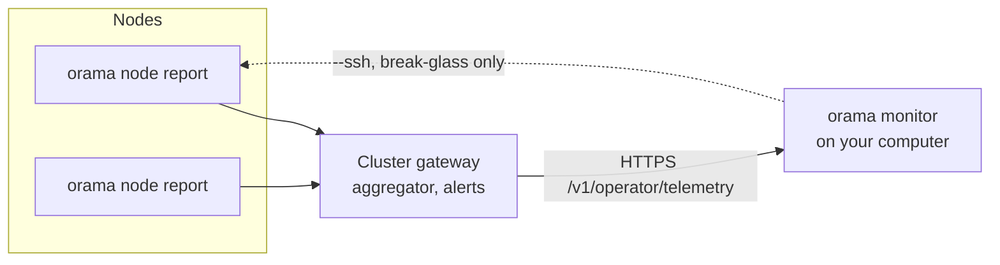

# Monitoring

Cluster health, from your machine. Three parts work together:

1. **`orama node report`** runs on each node, collects everything local and outputs JSON.
2. **The cluster gateway's telemetry** gathers every node's report, adds each gateway's request metrics, derives alerts, and serves the result to operators at `/v1/operator/telemetry`. A public projection is at `/status`.
3. **`orama monitor`** runs on your computer, reads that telemetry and shows it: a live view, or one aspect at a time.

## Quick start

```bash
orama status --env <env>                    # one line per node and a verdict
orama monitor --env <env>                   # live view, a snapshot every 5 seconds
orama monitor cluster --env <env>           # verdict, components, a row per node, top alerts
orama monitor alerts --env <env>            # alerts with what to do about each
orama monitor report --env <env>            # full JSON (pipe to jq, or feed to an LLM)
orama monitor cluster --env <env> --ssh     # gateways are down: read the nodes directly
```

You need to be signed in as an operator of the cluster (`orama auth login`). `--env` is required on every `orama monitor` command; it does not fall back to the active environment. (`orama status` does fall back to the active environment when you leave `--env` out.)

## How the data flows



By default the monitor makes **no SSH connection**. It reads one `ClusterSnapshot` (every node's report, how old each is, and the derived alerts) from the gateway, authenticated with the credentials `orama auth login` stored. Only the cluster's operators may read it.

`--ssh` is the break-glass path for when no gateway answers: it SSHes into every node, runs `sudo orama node report --json`, and derives alerts locally. It is **never chosen automatically**. When the API fails, the monitor stops and says why and suggests `--ssh`, so a gateway outage is reported as one. Traffic is counted by gateways, so it is empty over `--ssh`.

### What the gateway does

Every 10 seconds each node's cluster gateway asks the privileged helper to run the same collectors as `orama node report`, adds its own request metrics, and keeps the result as that node's latest report. Any cluster gateway assembles the cluster view by fetching every peer's report over the WireGuard mesh (signed with the coordination MAC, accepted only from a WireGuard address, 4 second timeout), in parallel, reusing one assembly for 5 seconds. A report older than 90 seconds counts as unreachable, so a node whose collection stopped never reads healthy. A peer on an older release answers 401 and shows as **unknown**, not down.

Load grows with the number of nodes, not the audience: viewers read the cached snapshot. Each watched gateway fetches every peer's full report every 5 seconds, which is fine at today's size and would need a compact per-node summary before hundreds of nodes.

### Telemetry API responses

| Response | Monitor exit code | Meaning |
|---|---|---|
| 400 | 2 | The gateway refused the request (for example `--interval` outside 2 to 60 seconds) |
| 401 | 3 | Credential not accepted. `orama env use <env>`, then `orama auth login` |
| 403 | 3 | This wallet is not an operator of the cluster |
| 404 | 4 | The gateway predates the telemetry API. Upgrade it, or use `--ssh` |
| 503 | 5 | The gateway is not ready yet. Retry, or use `--ssh` |
| unreachable | 5 | Cannot reach the gateway. Use `--ssh` |

A missing credential is an auth error; failing to reach the gateway to renew a session is an outage and leaves the session intact. A live view running through a rolling upgrade keeps its login.

## `orama monitor`

```text
orama monitor [subcommand] --env <environment> [flags]
```

| Flag | Meaning |
|---|---|
| `--json` | Machine-readable output (one-shot subcommands) |
| `--node` | Show only this node, by public IP or WireGuard IP, with the alerts about it |
| `--ssh` | Collect over SSH instead of the gateway API |
| `--config` | With `--ssh` only: read nodes from this file instead of resolving them |
| `--interval` | Live view only: how often a snapshot is streamed, 2 to 60 seconds (default 5s). With `--ssh`, minimum and default 15s |

| Subcommand | What it shows |
|---|---|
| `live` | The live view (default) |
| `cluster` | Verdict, component states, a row per node (health, raft, gateway, load, CPU steal, memory, disk, version, report age), unreachable nodes, top alerts |
| `node` | Per-node summary of every subsystem (system, RQLite, WireGuard, Olric, IPFS, Tor, chain, global, traffic). `--json` gives each node's full report. The Global line appears only on a node with a global unit installed: the public Kubo's repo use against `StorageMax`, the storage provider's deal slots held and pending, proof misses and hot-key balance, and whether the Tor relay is in the relay set. A figure the node's status file does not carry is left out |
| `service` | Service by node matrix of systemd states, restart loops, failed units |
| `mesh` | WireGuard interfaces (peers against the N-1 a full mesh needs) and each peer link's handshake age and traffic |
| `dns` | Nameservers: CoreDNS, Caddy, SOA, NS and wildcard resolution, TLS days left |
| `namespaces` | Each namespace's RQLite, Olric and gateway on each node hosting it |
| `alerts` | Distinct alerts, most severe first, each with a hint |
| `traffic` | Cluster totals (requests per second, 5xx rate, p50/p95/p99), a row per gateway, the busiest namespaces |
| `chain` | Orama L1: chain id, height, last block age, average block time, mempool, each node's sync, validators with voting power |
| `report` | Full JSON report |

### The verdict line

```text
✓ All systems operational · 3/3 nodes · updated 2s ago
✗ Degraded: Database (RQLite) · 2 critical, 1 warning · 3/3 nodes · updated 4s ago
✗ Outage: API Gateway · 3 critical · 3/3 nodes · updated 3s ago
```

It is the worst component state (operational, degraded, outage), made at least degraded by any critical alert. "3/3 nodes" counts nodes whose report came back. Old data is never shown as current: every view shows the snapshot's age and the live view turns it into `STALE` after three intervals.

### The live view

Tabs: 1 Overview, 2 Nodes, 3 Services, 4 Traffic, 5 Chain, 6 Mesh, 7 DNS, 8 Namespaces, 9 Alerts. The top lines show the connection state (`● live`, `◌ connecting…`, `↻ reconnecting…`, `✗ stopped`) and the verdict.

| Key | Action |
|---|---|
| `Tab` / `Shift+Tab` (or `l` / `h`) | Next or previous tab |
| `1` to `9` | Jump to a tab |
| Arrow up / down (or `k` / `j`) | Select a node, or scroll |
| `Enter` | On Nodes: open everything the node reported. `Esc` goes back |
| `c` `w` `i` `a` | On Alerts: show critical, warning, info, all |
| `r` | Fetch a snapshot now |
| `?` | Help |
| `q` / `Ctrl+C` | Quit |

If the stream drops the view reconnects with backoff (1 second doubling to 30, spread by 20 percent). A refused credential is not retried.

## Alerts

Derived from cross-node analysis of all reports by the cluster gateway (or by the monitor itself with `--ssh`). Each has a severity, subsystem and node.

| Severity | Examples |
|---|---|
| **critical** | Expired TLS certificate; clock skew over 60 seconds; node unreachable; no RQLite leader; split brain; RQLite unresponsive; a Raft snapshot term above the node's term; WireGuard interface down or peer never handshaked; OOM kills in the last hour; service failed; UFW inactive; chain RPC not answering while its unit is active; validator jailed or tombstoned; missed-block ratio at the downtime threshold; storage-provider hot-key balance 0 |
| **warning** | Memory over 90 percent; disk over 85 percent; stale WireGuard handshake (over 3 minutes); Raft term inconsistency; a follower silent over 2 seconds; commit-applied gap over 100; restart loop; TLS certificate under 14 days; DNS down; namespace gateway down; Tor SOCKS port not bound or not bootstrapped, Anyone-network leftovers; clock skew over 5 seconds; internet unreachable; chain height more than 20 blocks behind the median, or a block older than 60 seconds; provider proof misses; on a global node, an installed `orama-global-ipfs`, `orama-global-provider` or `orama-global-tor-relay` unit that is not active, the public Kubo repo over `StorageMax`, provider disk over its declared maximum, a relay reporting it is not in the relay set; a release refused or an install rolled back |
| **warning (contention)** | CPU steal over 20 percent (an oversubscribed host, which load average does not show); CPU pressure over 50 percent |
| **warning (security)** | systemd without `+BPF_FRAMEWORK` (tenant deployments' socket-bind restrictions are ignored on that node; Debian 12's systemd 252 lacks it); RAM hardening drift (`fs.suid_dumpable`, `kernel.core_pattern`, `kernel.yama.ptrace_scope`, swap in use, `apport.service` loaded and not masked) |
| **info** | Zombie processes; orphan orama processes; swap over 30 percent; tenant deployment OOM kills; a newer release found and not installed |

Cross-node checks: exactly one RQLite leader; all nodes agree on it; Raft terms within 1; each follower has heard from the leader within 2 seconds; every node has N-1 WireGuard peers; clocks within 5 seconds; all nodes on the same binary version; chain height not far behind the median.

`alerts`, `cluster` and the live view print a next step under each critical and warning alert, for example `orama inspect --env <env> --subsystem rqlite` or `orama ssh <host> --env <env> 'sudo orama node status'`.

## Global nodes

A node with `orama-global-ipfs`, `orama-global-provider` or `orama-global-tor-relay` installed adds a `global` section to its report (see [Global nodes](/docs/operator/global-nodes)). It holds each unit's state and, while the public Kubo is active, its repo size against `StorageMax`. The storage provider and the Tor relay each write a status file, `/var/lib/orama-global/provider/monitor.json` and `/var/lib/orama-global/tor-relay/monitor.json`, and the section adds the fields that file carries.

The Tor relay's file holds only `in_consensus`: whether the consensus the relay holds lists it. `orama-global-tor-monitor.timer` runs `orama global tor monitor` on the relay every five minutes to write it, and leaves the field out while the relay has no valid consensus, so a relay without a consensus is not alerted as missing from the relay set. The node report, the inspector and the health checks follow the Tor relay unit, so a relay that is installed and not active is an alert on its own.

## Components

The gateway turns reports into component states: operational (every node that runs it serves it), degraded, outage (no node serves it), unknown. The database is judged by Raft itself: out when every node reported and none leads, or when the leader's report shows no majority of **voters** reachable; losing non-voters only degrades it. DNS and TLS count only nodes with the nameserver role. A node on an older release mid-rollout is **unknown** and counts neither way.

## The public status page

`https://<base-domain>/status` is a status page, and `/v1/status` its JSON. It is served by the gateway itself on the bare base domain, is static and embedded, loads only its own script and stylesheet under a strict content security policy, and refreshes every 10 seconds. It shows the overall verdict, nodes healthy, requests per second, error rate and p95 latency, each service with a 90-day uptime bar (one bar per UTC day: at least 99.9 percent green, at least 95 amber, below that red), and the Orama chain's height, block time and validators' voting power, taken from the node at the median height.

The public projection has service states, uptime, node counts and chain progress, and no address, peer id, hostname or error text. Operator alerts (a firewall rule, a certificate expiring) do not change the public verdict. Uptime history is recorded once a minute by the lowest-id active node into a table kept for 90 days, and is not recorded while any node is unknown.

## Traffic metrics

Every gateway keeps live request metrics in memory (nothing is written to a database; a restart starts from zero): requests, 4xx and 5xx errors, bytes per second, requests per second, p50/p95/p99 from a log-spaced histogram (1 ms to 30 s), over the last 60 seconds. Requests are attributed to the namespace they resolved to, at most 256 namespaces per second and the 20 busiest in a snapshot. Paths and client addresses are never labels. The gateway's own health and telemetry plumbing is excluded. A request taking a second or more is also logged as `slow request` with the time per step (routing, auth, target lookup, upstream, rest): read it with `orama node logs orama-namespace-gateway@index`.

## In-cluster failure detection

Separately, every node's index gateway runs a ring monitor that drives automatic recovery.

| Property | Value |
|---|---|
| Ring | The next 3 nodes after this one in `dns_nodes` order |
| Probe | `GET /v1/internal/ping` on the peer's index gateway every 10 seconds |
| Suspect | 3 consecutive misses (about 30 seconds): that node's namespace DNS records are disabled |
| Dead | 12 consecutive misses (about 2 minutes), and at least 2 distinct observers agree |
| Startup grace | 5 minutes, during which no node is declared dead |

A heartbeat newer than 65 seconds outranks the probe, because the heartbeat is a Raft write and a fresh one proves the peer was alive and had quorum. Recovery is triggered only by the lowest-id observer once quorum agrees, so one confirmed death produces one recovery action.

Each node also probes the namespaces it hosts every 30 seconds and keeps its own DNS records in step: 3 consecutive non-healthy probes withdraw this node's `ns-<ns>` and wildcard records, 3 healthy ones restore them, and it never withdraws the last active record for a name. A restarted node can therefore be out of namespace DNS for several minutes while it serves. Watch it with `sudo orama node logs node --since -1h | grep 'namespace DNS round-robin'`.

## Monitor or inspector?

| | `orama monitor` | `orama inspect` |
|---|---|---|
| Data | The gateway's telemetry (or one SSH call per node) | About 12 SSH sessions per node |
| Focus | Real time health and alerts | Deep diagnostic checks, pass or fail |
| Use | "Is anything wrong right now?" | "What exactly is wrong and why?" |

See [Inspector](/docs/operator/inspector).

## Report format

`orama monitor report` writes one JSON document with `meta` (environment, collection time, node counts), `summary` (RQLite leader, quorum, mesh status, verdict), `components`, `alerts` and `nodes` (each with `host`, `role`, `status` of `ok`, `degraded` or `unreachable`, `report_age_sec`, and the full `report`). Fields are only ever added, never renamed or removed.
