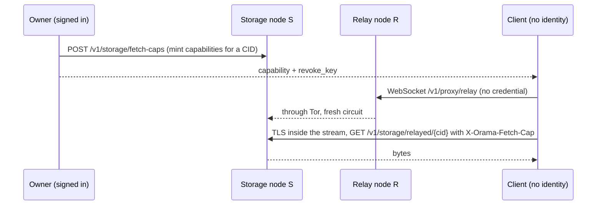

# Relayed fetch

Relayed fetch lets a client download a stored object without the node that holds it ever learning the client's address. A second node, the *relay*, carries the bytes, and the download is authorised by a *capability* instead of any identity.

## The idea



1. The owner mints capabilities. Each is bound to one canonical CID and one namespace.
2. The owner hands a capability to the person who should download it.
3. The client opens a WebSocket to the relay R. No credential is needed.
4. Inside that WebSocket the client runs TLS straight to S (`ns-<name>.<base-domain>`), carried through R's Tor client, and sends the request with the capability.

## What each party learns

| Party | Learns | Does not learn |
|---|---|---|
| Storage node S | The CID, the capability, a Tor exit address | The client's address, which relay carried it |
| Relay R | The client's address, the destination host, start time, duration, byte counts | The CID, the capability, the content |
| A network observer at the client | "The client talks to R over TLS" | S, the CID |

## Minting capabilities

`POST /v1/storage/fetch-caps` needs a device-bound session, the storage read grant, and ownership of the CID. One call mints up to 64 capabilities with a lifetime of 1 hour to 7 days. Each returns a `revoke_key`. A serverless function can mint through the `storage_fetch_cap_mint` host function.

A capability is bound to the exact canonical CID and namespace, derived under its own key-derivation purpose, with the issuing device sealed in an opaque tag. Revoking takes the `revoke_key` returned at mint, so nobody can fill the revocation list with invented ids. S limits a leaked capability by its expiry, its CID, revocation, 4 concurrent downloads per token, and the namespace's rate limit.

A sender should use **one capability per fetch**: S can link two fetches made with the same one.

## What the relay enforces

- No log: the route is `LogNone`. R writes no request-log row and no access-log line for a stream, so no address, byte count or duration is recorded. It keeps a request count by status and its rate-limit state, per address, in memory.
- Per client address: 30 streams a minute (burst 10) and at most 4 open at once.
- A pool of 128 streams, separate from the authenticated tunnels.
- 64 MiB each way and 5 minutes per stream.
- A fresh Tor circuit per stream.
- The destination is pinned: a plain ASCII hostname equal to, or under, one of `relay_allowed_suffixes`, port 443, no IP literal. A suffix that is a public suffix (`co.uk`, `github.io`) is refused at gateway start. With no setting, the allowed suffix is the cluster's own base domain.
- Errors: `400 RELAY_DESTINATION_NOT_ALLOWED`, `429 RATE_LIMITED`, `503 RELAY_UNAVAILABLE`. A relay failure is an error to the client, never a direct connection.

On S, `/v1/storage/relayed/` is `LogNoAddress`: S keeps the row (method, path, status, size, duration) with an empty address field.

## Using it from the SDK

Node.js only. The relay client lives in its own entry point because it needs `node:tls` and `ws`.

```ts
import { createClient } from "@debros/orama";
import { RelayedFetch } from "@debros/orama/relay";

// The owner: a device-bound session on the namespace.
const owner = createClient({ baseURL: "https://ns-myapp.cluster.example.com" /* signed in */ });
const { caps } = await owner.storage.mintFetchCaps(cid, { count: 1, ttlSeconds: 3600 });
// caps[0] is { id, revokeKey, token, expiresAt }. Keep revokeKey; give the rest to the downloader.

// The downloader: no identity needed.
const transport = new RelayedFetch({
  relays: ["https://other-cluster.example.net"],   // gateway(s) that carry the bytes
  namespaceHost: "ns-myapp.cluster.example.com",    // where the object is stored
  circuit: "fresh",                                 // "fresh" (default) or "session"
  jitterMs: 500,                                    // random delay before each request
});
const bytes = await owner.storage.fetchWith(transport, cid, caps[0]);
```

`mintFetchCaps(cid, { count, ttlSeconds })` takes `count` from 1 to 64 and `ttlSeconds` from 3,600 to 604,800. `revokeFetchCap(id, revokeKey)` revokes one. `fetchWith(transport, cid, cap)` downloads over the transport you chose and re-asks while a fresh pin propagates, like `get` does. `directTransport()` is the non-private baseline: it downloads with your own credential, so the storage node sees your address. The SDK picks one relay at random from `relays`, and it never falls back to another transport: a failure throws `RelayError` or `FetchCapError`. `RelayedFetchOptions` also has `ca`, `maxBodyBytes` and `timeoutMs`.

## What this does not defend against

- **A relay inside S's own cluster is not a privacy boundary.** Every node in a cluster holds the wildcard certificate key for its namespace hosts, so a relay in the same cluster can terminate the TLS itself and read the capability, the CID and the content. The default allow-list is the cluster's own base domain, so out of the box the relay is a node of the cluster it fetches from. The property holds only when R belongs to another operator or another cluster, which you arrange by listing that cluster's base domain in `relay_allowed_suffixes` on R.
- **A relay and a storage node run by the same operator, or colluding,** can join the two records by timing and size. A fresh circuit per fetch removes the easy join key, not the timing one. Fetching fixed-size chunks and a client-side delay (`jitterMs`) narrow it.
- R sees the response length (as ciphertext length). S sees which CID is asked for: this is not private information retrieval.
- The anonymity set is the size of the Tor network the traffic uses. A global passive adversary is out of scope, as is hiding that the client uses a relay.
- Browser and React Native clients need a native helper. Browser transport, a mixnet, paid relay admission and cross-operator relay selection are not built.

## Operator setting

`relay_allowed_suffixes` in the gateway config (YAML) lists the base domains a relay on this gateway may reach. Empty means this cluster's base domain. See [Gateway settings](/docs/operator/cluster-admin#gateway-settings).
